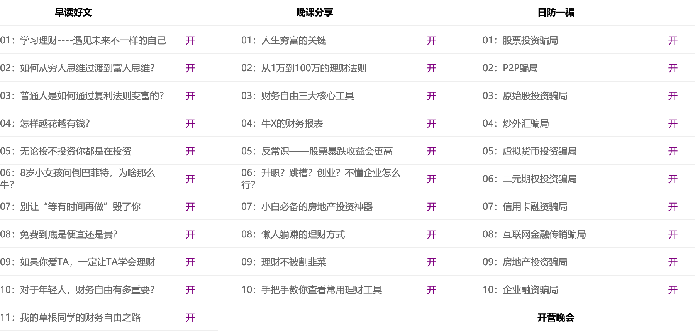

# **Content**
git add .
git commit  -m "day01"
git push  origin master 

[0.day00](#day00)  
[1.day01](#day01)  
[2.day02](#day02)  

#  **富人思维索引**

>[第一条](#21富人思维第一条)  
[第二条](#36富人思维第二条)  
[第三条](#37富人思维第三条)  
[第四条](#富人思维第四条)  
[第五条](#富人思维第五条)  
[第六条](#富人思维第六条)  
[第七条](#富人思维第七条)  
[第八条](#富人思维第八条)  
[第九条](#富人思维第九条)  
[第十条](#富人思维第十条)  
[第十一条](#富人思维第十一条)  

readme:此仓库为自己在一个代码学习公众号的推送课程学习做的笔记.12元12天，价格不是很贵就报了，目前正在学习中。其中内容并不代表个人观点(特别是外链文章)，理工科出身对目录中的这种标题是极其反感的，内容嘛目前不好说，各位看官自己甄别取舍.  
#  **day00**

0.上课形式：早读(07.30) + 防骗(12.00) + 晚课(20.30) + 作业.  
1.<小狗钱钱>精华解读.  
2.富人思维.  
##  0.开课

课程目录：

##  1.<小狗钱钱>精华解读.

 - [小狗钱钱.喜马拉雅听书.](https://www.ximalaya.com/search/%E5%B0%8F%E7%8B%97%E9%92%B1%E9%92%B1)
 - [小狗钱钱](./doc/小狗钱钱.pdf)节选：  
钱钱给吉娅提出了四条忠告：

1、 欠债的人应当注销所有的信用卡。  
2、 按最低的还款标准偿还贷款。  
3、 对于消费贷款，应该将不用于生活的钱一半存起来，一半还债。  
4、 对于所有的消费，都要问自己“这真的有必要吗？”  

下面我来说一下这四条忠告。

第一条欠债的人应当注销信用卡，说的其实是要消除消费产生的负债。消费产生的负债是坏负债，它会让我们在债务的泥潭中越陷越深，越来越穷，最终陷入财务危机之中。欠债的人不但要注销信用卡还要注销一切类信用卡的东西，比如花呗、白条、消费贷之类看起来很贴心但却会让我们越来越穷的东西。

第二条按最低的还款标准偿还贷款，说的是因资产特别是生钱资产产生的贷款要尽可能的延长偿还时间。生钱资产产生的负债是好负债。因为生钱资产产生的现金流入能够覆盖贷款产生的现金流出。资产会帮我们还债，而且还会有结余。另外资产的价格还会上涨。这样我们就会越来越富有。

第三条说的是要消除消费贷款多存钱。存钱就是养鹅，鹅养肥了它就可以下金蛋。没有鹅的人是不能富有的。

第四条说的是要理性消费，尽可能的减少不必要的开支。尽快把自己下金蛋的鹅养肥。

这里我要强调一下会下金蛋的鹅。金先生通过一个故事告诉吉娅，不要杀死自己的鹅，这个故事让我印象非常深刻。一个农夫有一只下金蛋的鹅，农夫开始很高兴。后来农夫的欲望越来越大，鹅下金蛋的速度赶不上农夫欲望膨胀的速度。于是农夫就杀鹅取卵，最后农夫没了鹅也没了金蛋。农夫又变成了穷光蛋。

吉娅一开始的打算是，存足够的钱，然后花完这些钱去实现自己的梦想。如果吉娅真的这么做了，那么吉娅同样也是杀死了自己的鹅。那该怎么办呢？金先生告诉吉娅，把自己挣的钱，分成三部分，一部分储蓄起来养鹅，一部分放在梦想储蓄罐，一部分零用。而金先生把自己二分之一的钱都储蓄起来养鹅。这么睿智的建议，不愧是拥有劳斯莱斯的男人。而在现实生活中，很多人往往因为控制不了自己的消费欲望而杀死自己的鹅，比如说花光自己所有的积蓄去买名牌衣服、包包，贷款买车等。我并不是反对买好东西，更不反对过高品质的生活，但是你应该用零用钱或梦想储蓄罐里的钱去买，而不是杀死自己的鹅。吉亚从刚开始控制不住自己的消费欲望，为了新出的CD就要花完自己所有的零花钱；到建立自己的梦想储蓄罐，为了自己的梦想开始运用自己的优点来赚钱，但是没有自己的鹅；再到开始养鹅。从负债到梦想储蓄罐到养鹅，我们可以看到吉娅财商升级的历程。

各位同学也可以想想自己现在处于哪个阶段？如果你一直处于第一个阶段，很有可能现在是月光甚至已经负债累累了。从这里我们也可以看出，你目前的财务状况其实只是一种结果，富有也好，负债累累也好，往往并不是原因。那什么是原因呢？书中富有的陶穆太太家里遭贼了，但是陶穆太太非常淡定，她说：钱只会留在那些为之付出努力的人身边，用非法手段取得不义之财的人，反而会比没钱的时候感觉更糟。我认为陶穆太太的意思是，穷人和富人差的永远不仅仅是钱，更重要的是思维。如果你具备了富人思维，你就会变得越来越富有。但是如果你不具备富人思维，即便突然有了很多钱，这笔钱也会离你而去的。

我看过一个研究，世界上彩票中大奖的人。大概有90%左右的人在中奖10年后的生活比中奖前要悲惨的多。思维是穷富的关键原因，而思维并不会因为你突然有了一大笔钱而改变。思维只能通过学习、思考、训练来改变。关于思维同学们可以思考一个问题。如果你买彩票中了 1000 万，你会如何花这笔钱？很多年前我的想法是这样的：500 万买个房子， 100 万买辆跑车， 100 万孝敬父母， 100 万出去玩，200万放在银行里吃利息。想想当时的思维真的是高纯度的穷人思维啊。你会怎么花这笔钱呢？你的思维是穷人思维还是富人思维呢？

### 1.1.欠债的人应当停止坏支出.
- 好支出：可以带来更多收入的支出；
- 坏支出：让你的钱变得更少的支出。

### 1.2.当尽可能少地偿还好负债带来的贷款.
尽可能将好负债的贷款期限延长一些，然后使用每月剩余的钱生钱.

### 1.3.对于消费贷款，欠债的人应该将不用于生活的钱一半存起来(钱生钱)，另一半用于还债.
记住:收入-储蓄=支出.而不是:收入-支出=储蓄.先储蓄后消费与先消费后储蓄有本质区别.

> 先储蓄后消费：每个人都可以从日常小事开始做起，比如先储蓄再消费。
> 假如你月收入只有1000元，你至少可以存下10%，100元。拿剩下的900元再去消费。我相信每个月100元并不会对你的日常生活造成什么影响。但是这和你拿着1000元去消费，想着我剩多少存多少，结果会完全不一样。
> 先储蓄后消费，月光族思维改变的第一步！

- [摆脱负债我是怎么做到的.](https://mp.weixin.qq.com/s?__biz=MzUyMTMzNzIwMg==&mid=2247483703&idx=1&sn=469de539e93691a59ddc8a571afa3997&chksm=f9dde12aceaa683c2ad6fb09fb199bda45e36402802b9e18c8e06c19ca65c4dc587edc8ec482&mpshare=1&scene=1&srcid=12197ICdhFHd1L7BWc6ilu0K&sharer_sharetime=1576741529639&sharer_shareid=7f2ef8062db941cd6f362e2b47bfec4b&exportkey=A4dMkMXTbRj3ESLC3RlrBUw%3D&pass_ticket=ZYSINZZTwwYR48b5EB%2FaOYIfTcAzsEvb7Fj4FaohLuwq8dA9HrUINDNmt09UtcwG#rd)[**这种文章个人认为堪比咪蒙公众号文章，有过之而无不及，各位看官自己权衡取舍.**]

### 1.4.对于所有的消费，都要问自己'这真的有必要吗？'

> 名牌衣服包包、贷款买车等应该是使用零用钱或存钱罐中的钱，而不是杀自己的鹅.
消费产生的负债是坏负债，坏负债会持续的带来净现金流出，坏负债会让我们在债务的泥潭中越陷越深，越来越穷，最终陷入财务危机之中。

##  2.富人思维.
思维才是最根本的原因！穷人思维导致贫穷的结果，富人思维导致富有的结果。[像极了洗脑的脑残台词.]

###  2.1.富人思维第一条
🔆获得经济独立、财务自由的意义是什么？

- 经济独立、财富自由并不是独善其身，它的本质是让自己、家人变的更好的能力。
- 从个人讲，可以更好的选择自己喜欢的东西、自己喜欢的生活方式、婚姻方式，最终实现踏踏实实靠自己，得来属于自己的精神自由。把经济这个生存的“命脉”交给他人，其实就是把自己选择的权力让给了他人，也把自己生活的主动权让给了他人。
- 从家庭讲，与爱人共同分担家庭的财务重担，应对老人的医疗花销、孩子的教育花销，让家庭关系因为共同的努力获得财富而更美好，而不是因为钱受到冲击而动摇。
- 总结：提升理财技能，实现财务独立，获得更多自主选择的权力，获得给家人更好的生活的能力。  
[回到顶部](#readme)

# **day01**

##  1.早读.学习理财--预见未来不一样的自己

- [早读](http://xiaobai.yaocaiwuziyou.com/index.php/Home/OldTest/Zao?num=1)

##  2.防骗.股票投资骗局

> 股票这个工具本身是没有问题的，股市依然有很多人赚钱。但是，如果以投机的方式对待股市，不懂就乱投，那么本质就是赌博，赌博的风险当然是非常大的。如果以投资的心态，做公司的合伙人，关注公司的好坏，那么你的财富就会随着好公司的成长而增长。

##  3.晚课.人生穷富的关键

###  3.1.理财和投资的区别

- 理财：凡是涉及到跟钱有关的安排，都是理财。
- 投资：只是理财的一部分，理财是一个很广泛的概念。比如制定家庭日常消费计划、投资计划、保险计划、教育金计划、养老金计划等等都是理财中的一部分。

计划：  
>1、**消费计划**：收入-储蓄=支出（先储蓄后消费）；分清必要支出、不必要支出、好支出、坏支出。  
>2、**投资计划**：学习钱生钱的技能。  
>3、**保险计划**：实现财务自由前的防火墙。  
>4、**教育金计划、养老金计划**：一个理财工具就搞定了——指数基金。 

保险属于家庭保障体系，也是理财的一部分，不可忽视。在我们实现财务自由之前，保险为我们的家庭财产设置了一道防火墙。但是这里提醒同学们，只推荐**保障型保险**，保险做好它的本职工作——保障就好了，不买返还型保险，明天过后你会知道它的收益实际上是负的。买保险其实不需要那么多钱，也是因为大家不懂，所以才会被忽悠购买储蓄型保险，保险其实花不了那么多钱！保险只推荐保障型保险，几百块就够用了.

###  3.2.资产划分

根据拥有资产的多少，我们把拥有资产的人分为无产者、中产、富人等。有房有车就是中产，无产就是一点资产都没有，月光、负债。准确知道自己处在什么位置，后面才知道怎么配置资产。我们既然要配置资产，那么就得明白什么是资产。

- 资产的内涵是**现金流**。

资产产生现金流的方式不同就决定了资产的不同。根据资产产生现金流的不同，可以把资产分成3种。

- 1.生钱资产：能给你持续带来净现金流入的东西。有了生钱资产，你就可以躺着数钱了。这就是所谓的睡后收入。生钱资产养人呐。eg:
- 2.耗钱资产：能给你持续带来净现金流出的东西。有了耗钱资产，你躺着的时候还在付钱。这就是所谓的睡后支出。耗钱资产需要被人养，耗钱资产耗人啊。  
eg:自住房没有现金流入，只有现金流出，所以是耗钱资产。对于投资房，如果月供等开支大于每月租金，是耗钱资产，等于是其他资产，小于是生钱资产。私家车是自用的，每年都有保险费、保养费、停车费等支出，私家车持续的带来净现金流出，所以私家车是耗钱资产。（跑滴滴，即使私家车出去跑业务，也需要投入大量时间和精力，你赚的是劳动收入。并不是非工资收入！对于车本身而言，它并没有现金流出流入。如果你不拉活，就没有这笔收入，所以私家车还是耗钱资产。）
- 3.其他资产：产生的净现金流为0的东西。有了其他资产，你躺着的时候你就是在躺着，什么也没有。

关于买房子，建议：
如果你买房是为了娶媳妇，自住房，那么必须买。但是如果你买房是为了投资，目前中国是不合适的，是耗钱资产。大家要明白你做事的目的，你目的是自住，那就是刚需，耗钱也得买。负债也是资产的一部分啊,但是你目的是投资，那就不一样了。而且，自住是耗钱资产，压力大，怎么办呢？应该增加其他生钱资产的配置，让生钱资产生的钱去养着耗钱资产。这样才能减轻压力，而不是彻底不住了，或者有了钱一股脑全还了房贷。

###  3.3.财务自由的定义

要想**实现财务自由，就是要源源不断地拥有生钱资产**，当生钱资产生的钱大于日常生活开支时，你就财务自由了！非工资收入就是不需要劳动就可以有的收入，包括像利息、股息、分红、版税等等收入，即是生钱资产.

-  工资收入就是自己付出时间、精力、汗水挣来的钱。大部分人都是拿工资的，你必须去上班才有收入，这种就是工资收入.
-  非工资收入就是，不需要去劳动，也能有收入。就像有人说的：躺着就把钱赚了或者不干活也有钱，比如利息、股息、分红、版税、专利等收入.
-  靠工资攒钱是最低效最差的方式，如果只靠工资收入来攒钱，很可能到退休了还没有攒够理财的本金.

**很多同学说没钱，但没钱只是不学习理财的结果而不是你不学习理财的原因。聪明的同学会在获得第一笔工资收入时，就开始选择合适的理财工具来积累自己的本金和非工资收入了.**具有富人思维的人从一开始就**通过工资和非工资收入两条路径来增加自己的收入.**

###  3.4.现金流
普通人或者说中产阶级的现金流:  

- 中产的资产中主要是耗钱资产，以房子、车子为主。
- 中产可能有贷款也可能没有贷款
- 中产的收入主要来自工资收入。
- 中产把工资收入变成了耗钱资产，耗钱资产不停消耗中产的钱。
- 为了养耗钱资产，中产是不能停止工作的。由于耗钱资产的存在，中产几乎是很难变富有的。
- 大部分负债是耗钱资产，是坏负债。所以你们会说，房奴。

富人的现金流:  

- 富人的收入主要来自生钱资产！
- 生钱资产产生的现金流入完全能够覆盖各种支出。
- 富人不用为了生活而去工作！

### 3.5.中产家庭为什么不能沉溺在自己的工资收入中？

- 孩子还未成人的家庭:孩子没有收入，花销逐年增大，这时候如果夫妻中有一人遇到一段时间不能工作的情况，家庭财务整体情况可能会出现较大落差，进而影响生活质量。
- 全职宝妈的家庭:女性负责照顾孩子，没有工资性收入，只有老公一人的收入是家庭收入的主要来源。如果老公遭遇大裁员等意外情况，家庭很可能立即陷入坐吃山空的财务危机中，或者啃老的尴尬境地。

所以中产家庭更需要尽早尽快建立自己的非工资收入体系.在没发生意外的时候，可以为家庭提供一份额外的收入，补贴家用。在发生意外的时候，能够抵御财务风险，不至于到毫无收入的被动地步。

###  3.6.富人思维第二条
月光或者积蓄不多的人，为什么不能等有钱再学习理财？
- 1.月光和积蓄不多本质是错误理财思维造成的结果。
- 2.**在花钱上**，很多都是坏支出，一心只想买买买，很多东西在冲动消费之后要么用了几次就放置一边，要么后悔自责又在下次陷入到恶性循环。但对于投资自己成长的好支出，却又思前想后，犹豫不决。其关键在于，没有好支出、坏支出的思维意识，被欲望牵着走，没有将有限的资金花在刀刃上。
- 3.**在攒钱上**，单纯靠工资攒钱是最低效最差的方式。如果只靠工资收入来攒钱，很可能到退休了还没有攒够理财的本金。真正聪明的同学会在获得第一笔工资收入时就开始选择合适的理财工具来积累自己的本金和非工资收入了。

具有富人思维的人，哪怕是现在月光或者积蓄不多，就会从一开始就通过工资和非工资收入两条路径来增加自己的收入。  
[回到顶部](#readme)  
###  3.7.富人思维第三条
中产家庭为什么不能沉溺在自己的工资收入中？
- 1.中产家庭看似收入比较稳定，其实抗风险能力不强，他们有房贷、车贷要还，小孩要养，甚至父母还要大量的开销。
- 2.孩子还未成人的家庭，孩子没有收入，花销逐年增大，这时候如果夫妻中有一人遇到一段时间不能工作的情况，家庭财务整体情况可能会出现较大落差，进而影响生活质量。
- 3.全职宝妈的家庭，女性负责照顾孩子，没有工资性收入，只有老公一人的收入是家庭收入的主要来源，如果老公遭遇大裁员等意外情况，家庭很可能立即陷入坐吃山空的财务危机中，或者啃老的尴尬境地。

所以中产家庭更需要尽早尽快建立自己的非工资收入体系，在没发生意外的时候，可以为家庭提供一份额外的收入，补贴家用；在发生意外的时候，能够抵御财务风险，不至于到毫无收入的被动地步。  
[回到顶部](#readme)

# day02

##  1.早读.如何从穷人思维过渡到富人思维

##  2.午防.P2P骗局

##  3.晚课.从1万到100万

[回到顶部](#readme)

