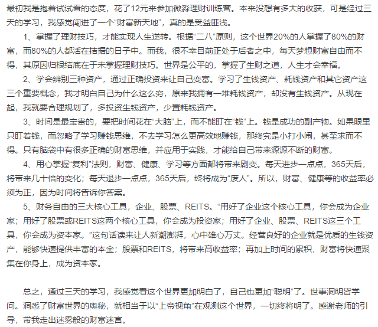
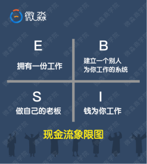
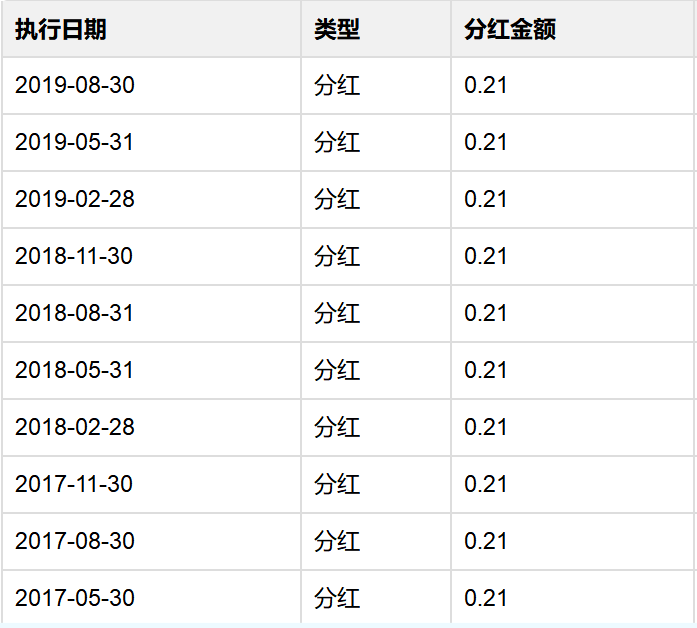

# **Content**

readme:此仓库为自己在学习一个代码学习公众号的推送课程中做的笔记.12元12天，价格不是很贵就报了，目前正在学习中。其中内容并不代表个人观点(特别是外链文章)，理工科同学对目录中的这种标题是极其反感的，内容嘛目前不好说，各位看官自己甄别取舍.方便的话请点个赞，我会尽量将12天更新完.  

20191224update.学习至day5,发现课程会讲很多现象，使用专业术语将一些现象阐述出来，让人觉得十分有道理，也确实是有道理的，如何改变这种现象也会宏观的提及，但是涉及到具体的操作不会讲，应该是为后面的收费课程做铺垫了.无形鸡汤最为鸡汤，这个鸡汤算是自己给自己打的了.但总的来讲12元还是值得的，后续的知识也是有必要学习的但是途径是另谋他法还是继续跟进，各位看官理性分析.  

20191225update.day6的课程广告愈加明显，根本没讲到点鸡汤味儿很明显了.

  
|day|早读好文|晚课分享|日防一骗  
|---|---|---|---  
|[day01](#day01)|[01.学习理财-遇见未来不一样的自己](#1早读学习理财--预见未来不一样的自己)|[01.穷富的关键](#3晚课人生穷富的关键)|[01.股票投资骗局](#2防骗股票投资骗局)  
|[day02](#day02)|[02.如何从穷人思维过渡到富人思维](#1早读如何从穷人思维过渡到富人思维)|[02.从1万到100万的理财法则](#3晚课从1万到100万的理财法则)|[02.P2P骗局](#2午防P2P骗局)  
|[day03](#day03)|[03.普通人是如何通过复制法则变富的](#1早读普通人是如何通过复制法则变富的)|[03.财务自由的三大核心工具](#3晚课财务自由的三大核心工具)|[03.原始股票投资骗局](#2午防原始股票投资骗局)  
|[day04](#day04)|[04.怎样越花钱越有钱](#1早读怎样越花钱越有钱)|[04.牛X的财务报表](#3晚课牛X的财务报表)|[04.炒外汇骗局](#2午防炒外汇骗局)  
|[day05](#day05)|[05.无论投资不投资你都在投资](#1早读无论投资不投资你都在投资)|[05.反常识-股票暴跌收益会更高](#3晚课反常识-股票暴跌收益会更高)|[05.虚拟货币投资骗局](#2午防虚拟货币投资骗局)  
|[day06](#day06)|[06.8岁小女孩问倒巴菲特，为啥那么牛](#1早读8岁小女孩问倒巴菲特为啥那么牛)|[06.升职、跳槽、创业、不懂企业怎么行](#3晚课升职跳槽创业不懂企业怎么行)|[06.二元期货投资骗局](#2午防二元期货投资骗局)  
|[day07](#day07)|[07.别让‘等有时间再做’毁了你](#1早读别让等有时间再做毁了你)|[07.小白必备的房地产投资神器](#3晚课小白必备的房地产投资神器)|[07.信用卡融资骗局](#2午防信用卡融资骗局)  
|[day08](#day08)|[08.免费到底是便宜还是贵](#1早读免费到底是便宜还是贵)|[08.懒人躺赚的理财方式](#3晚课懒人躺赚的理财方式)|[08.互联网金融传销骗局](#2午防互联网金融传销骗局)  
|[day09](#day09)|[09.如果你爱TA，一定让TA学会理财](#1早读如果你爱TA一定让TA学会理财)|[09.理财不被割韭菜](#3晚课理财不被割韭菜)|[09.房地产投资骗局](#2午防房地产投资骗局)  
|[day10](#day10)|[10.对于年轻人，财务自由有多重要](#1早读对于年轻人财务自由有多重要)|[10.手把手教你查看常用理财工具](#3晚课手把手教你查看常用理财工具)|[10.企业融资骗局](#2午防企业融资骗局)  
|[day11](#day11)|[11.我的草根同学的财务自由之路](#1早读我的草根同学的财务自由之路)||  

#  **富人思维索引**

- [x] [第一条](#21富人思维第一条)  
- [x] [第二条](#36富人思维第二条)  
- [x] [第三条](#37富人思维第三条)  
- [x] [第四条](#34富人思维第四条)  
- [x] [第五条](#35富人思维第五条)
- [x] [第六条](#36富人思维第六条)  
- [x] [第七条](#33富人思维第七条)  
- [x] [第八条](#34富人思维第八条)  
- [x] [第九条](#35富人思维第九条)  
- [x] [第十条](#33富人思维第十条)  
- [x] [第十一条](#34富人思维第十一条)  
- [x] [第十二条](#35富人思维第十二条)  
- [ ] [第十三条](#富人思维第十三条)  
- [ ] [第十四条](#富人思维第十四条)  

# **外链文章**

|早读好文|晚课分享|日防一骗  
|---|---|---  
|[01.学习理财-遇见未来不一样的自己](http://note.youdao.com/noteshare?id=d25d9e2344e4d09e2e31200e631de8f4)|[01.穷富的关键](http://note.youdao.com/noteshare?id=9d81ce3cdad89b2db72bee33da7439a5)|[01.股票投资骗局](http://note.youdao.com/noteshare?id=d1bb9c6d8abf6f889455a8326b8e8cc4)  
|[02.如何从穷人思维过渡到富人思维](http://note.youdao.com/noteshare?id=a638938fc9d7debc67d3cc5a6ed49ef1)|[02.从1万到100万的理财法则](http://note.youdao.com/noteshare?id=8c1af97e53f286148dcfa75bfa3d2fe8)|[02.P2P骗局](http://note.youdao.com/noteshare?id=5a0be00f12deb3a0907f60aed81a38ce)  
|[03.普通人是如何通过复制法则变富的](http://note.youdao.com/noteshare?id=8a18d0c80b7669500c46a20a1acf8034)|[03.财务自由的三大核心工具](http://note.youdao.com/noteshare?id=46a799f28797464247ab4387b9012da5)|[03.原始股票投资骗局](http://note.youdao.com/noteshare?id=1ef7439f6e5bae1d5eb0e2e71875f6aa)  
|[04.怎样越花钱越有钱](http://note.youdao.com/noteshare?id=e5da3f59a5f69302a57cc592b0d85973)|[04.牛X的财务报表](http://note.youdao.com/noteshare?id=bf374ee2227c08a983eb745c49140a39)|[04.炒外汇骗局](http://note.youdao.com/noteshare?id=6edb52cb869bc918e82f230863b873f7)  
|[05.无论投资不投资你都在投资](http://note.youdao.com/noteshare?id=31d96a44feccc7df1db8f25f73bc891f)|[05.反常识-股票暴跌收益会更高](http://note.youdao.com/noteshare?id=e2c73932ef3385219bfdd82412e11cf4)|[05.虚拟货币投资骗局](http://note.youdao.com/noteshare?id=0b53ae01582db0652128572a3aa00368)  
|[06.8岁小女孩问倒巴菲特，为啥那么牛](http://note.youdao.com/noteshare?id=e2fccc689d65dd8bc05ecaca094b97c3)|[06.升职、跳槽、创业、不懂企业怎么行](http://note.youdao.com/noteshare?id=c4c07ed5ce5d692307092c043ddbac85)|[06.二元期货投资骗局](http://note.youdao.com/noteshare?id=ce1e70aa5f5952e0d11ac2309f3682d7)  
|[07.别让‘等有时间再做’毁了你](http://note.youdao.com/noteshare?id=eabb3aae6cc2a5b4099090fbf15fbc97)|[07.小白必备的房地产投资神器](http://note.youdao.com/noteshare?id=ae392d65d2063eaa67e4b71942230afa)|[07.信用卡融资骗局](http://note.youdao.com/noteshare?id=f864e05174237a0374f0e292d9cc3557)  
|[08.免费到底是便宜还是贵](http://note.youdao.com/noteshare?id=e252a3c892924cf16fcd9a555a83f30f)|[08.懒人躺赚的理财方式](#3晚课懒人躺赚的理财方式)|[08.互联网金融传销骗局](#2午防互联网金融传销骗局)  
|[09.如果你爱TA，一定让TA学会理财](#1早读如果你爱TA一定让TA学会理财)|[09.理财不被割韭菜](#3晚课理财不被割韭菜)|[09.房地产投资骗局](#2午防房地产投资骗局)  
|[10.对于年轻人，财务自由有多重要](#1早读对于年轻人财务自由有多重要)|[10.手把手教你查看常用理财工具](#3晚课手把手教你查看常用理财工具)|[10.企业融资骗局](#2午防企业融资骗局)  
|[11.我的草根同学的财务自由之路](#1早读我的草根同学的财务自由之路)||  

外链文章中，“早读好文”基本都是洗脑文章，说服力方面还赶不上咪蒙文章.
 
#  **day00**

##  0.开课

0.上课形式：早读(07.30) + 防骗(12.00) + 晚课(20.30) + 作业.  

今日内容：
1.<小狗钱钱>精华解读.  
2.富人思维.  

-   

##  1.<小狗钱钱>精华解读.

 - [小狗钱钱.喜马拉雅听书.](https://www.ximalaya.com/search/%E5%B0%8F%E7%8B%97%E9%92%B1%E9%92%B1)
 - [小狗钱钱](./doc/小狗钱钱.pdf)节选：  
钱钱给吉娅提出了四条忠告：

1、 欠债的人应当注销所有的信用卡。  
2、 按最低的还款标准偿还贷款。  
3、 对于消费贷款，应该将不用于生活的钱一半存起来，一半还债。  
4、 对于所有的消费，都要问自己“这真的有必要吗？”  

[回到顶部](#readme)  
下面我来说一下这四条忠告。

第一条欠债的人应当注销信用卡，说的其实是要消除消费产生的负债。消费产生的负债是坏负债，它会让我们在债务的泥潭中越陷越深，越来越穷，最终陷入财务危机之中。欠债的人不但要注销信用卡还要注销一切类信用卡的东西，比如花呗、白条、消费贷之类看起来很贴心但却会让我们越来越穷的东西。

第二条按最低的还款标准偿还贷款，说的是因资产特别是生钱资产产生的贷款要尽可能的延长偿还时间。生钱资产产生的负债是好负债。因为生钱资产产生的现金流入能够覆盖贷款产生的现金流出。资产会帮我们还债，而且还会有结余。另外资产的价格还会上涨。这样我们就会越来越富有。

第三条说的是要消除消费贷款多存钱。存钱就是养鹅，鹅养肥了它就可以下金蛋。没有鹅的人是不能富有的。

第四条说的是要理性消费，尽可能的减少不必要的开支。尽快把自己下金蛋的鹅养肥。

这里我要强调一下会下金蛋的鹅。金先生通过一个故事告诉吉娅，不要杀死自己的鹅，这个故事让我印象非常深刻。一个农夫有一只下金蛋的鹅，农夫开始很高兴。后来农夫的欲望越来越大，鹅下金蛋的速度赶不上农夫欲望膨胀的速度。于是农夫就杀鹅取卵，最后农夫没了鹅也没了金蛋。农夫又变成了穷光蛋。

吉娅一开始的打算是，存足够的钱，然后花完这些钱去实现自己的梦想。如果吉娅真的这么做了，那么吉娅同样也是杀死了自己的鹅。那该怎么办呢？金先生告诉吉娅，把自己挣的钱，分成三部分，一部分储蓄起来养鹅，一部分放在梦想储蓄罐，一部分零用。而金先生把自己二分之一的钱都储蓄起来养鹅。这么睿智的建议，不愧是拥有劳斯莱斯的男人。而在现实生活中，很多人往往因为控制不了自己的消费欲望而杀死自己的鹅，比如说花光自己所有的积蓄去买名牌衣服、包包，贷款买车等。我并不是反对买好东西，更不反对过高品质的生活，但是你应该用零用钱或梦想储蓄罐里的钱去买，而不是杀死自己的鹅。吉亚从刚开始控制不住自己的消费欲望，为了新出的CD就要花完自己所有的零花钱；到建立自己的梦想储蓄罐，为了自己的梦想开始运用自己的优点来赚钱，但是没有自己的鹅；再到开始养鹅。从负债到梦想储蓄罐到养鹅，我们可以看到吉娅财商升级的历程。

各位同学也可以想想自己现在处于哪个阶段？如果你一直处于第一个阶段，很有可能现在是月光甚至已经负债累累了。从这里我们也可以看出，你目前的财务状况其实只是一种结果，富有也好，负债累累也好，往往并不是原因。那什么是原因呢？书中富有的陶穆太太家里遭贼了，但是陶穆太太非常淡定，她说：钱只会留在那些为之付出努力的人身边，用非法手段取得不义之财的人，反而会比没钱的时候感觉更糟。我认为陶穆太太的意思是，穷人和富人差的永远不仅仅是钱，更重要的是思维。如果你具备了富人思维，你就会变得越来越富有。但是如果你不具备富人思维，即便突然有了很多钱，这笔钱也会离你而去的。

我看过一个研究，世界上彩票中大奖的人。大概有90%左右的人在中奖10年后的生活比中奖前要悲惨的多。思维是穷富的关键原因，而思维并不会因为你突然有了一大笔钱而改变。思维只能通过学习、思考、训练来改变。关于思维同学们可以思考一个问题。如果你买彩票中了 1000 万，你会如何花这笔钱？很多年前我的想法是这样的：500 万买个房子， 100 万买辆跑车， 100 万孝敬父母， 100 万出去玩，200万放在银行里吃利息。想想当时的思维真的是高纯度的穷人思维啊。你会怎么花这笔钱呢？你的思维是穷人思维还是富人思维呢？  
[回到顶部](#readme)   
### 1.1.欠债的人应当停止坏支出.
- 好支出：可以带来更多收入的支出；
- 坏支出：让你的钱变得更少的支出。

### 1.2.当尽可能少地偿还好负债带来的贷款.
尽可能将好负债的贷款期限延长一些，然后使用每月剩余的钱生钱.

### 1.3.对于消费贷款，欠债的人应该将不用于生活的钱一半存起来(钱生钱)，另一半用于还债.
记住:收入-储蓄=支出.而不是:收入-支出=储蓄.先储蓄后消费与先消费后储蓄有本质区别.

> 先储蓄后消费：每个人都可以从日常小事开始做起，比如先储蓄再消费。
> 假如你月收入只有1000元，你至少可以存下10%，100元。拿剩下的900元再去消费。我相信每个月100元并不会对你的日常生活造成什么影响。但是这和你拿着1000元去消费，想着我剩多少存多少，结果会完全不一样。
> 先储蓄后消费，月光族思维改变的第一步！

- [摆脱负债我是怎么做到的.](https://mp.weixin.qq.com/s?__biz=MzUyMTMzNzIwMg==&mid=2247483703&idx=1&sn=469de539e93691a59ddc8a571afa3997&chksm=f9dde12aceaa683c2ad6fb09fb199bda45e36402802b9e18c8e06c19ca65c4dc587edc8ec482&mpshare=1&scene=1&srcid=12197ICdhFHd1L7BWc6ilu0K&sharer_sharetime=1576741529639&sharer_shareid=7f2ef8062db941cd6f362e2b47bfec4b&exportkey=A4dMkMXTbRj3ESLC3RlrBUw%3D&pass_ticket=ZYSINZZTwwYR48b5EB%2FaOYIfTcAzsEvb7Fj4FaohLuwq8dA9HrUINDNmt09UtcwG#rd)[**这种文章个人认为堪比咪蒙公众号文章，有过之而无不及，各位看官自己权衡取舍.**]

### 1.4.对于所有的消费，都要问自己'这真的有必要吗？'

> 名牌衣服包包、贷款买车等应该是使用零用钱或存钱罐中的钱，而不是杀自己的鹅.
消费产生的负债是坏负债，坏负债会持续的带来净现金流出，坏负债会让我们在债务的泥潭中越陷越深，越来越穷，最终陷入财务危机之中。  

[回到顶部](#readme)  
##  2.富人思维.
思维才是最根本的原因！穷人思维导致贫穷的结果，富人思维导致富有的结果。[像极了洗脑的脑残台词.]

###  2.1.富人思维第一条
🔆获得经济独立、财务自由的意义是什么？

- 经济独立、财富自由并不是独善其身，它的本质是让自己、家人变的更好的能力。
- 从个人讲，可以更好的选择自己喜欢的东西、自己喜欢的生活方式、婚姻方式，最终实现踏踏实实靠自己，得来属于自己的精神自由。把经济这个生存的“命脉”交给他人，其实就是把自己选择的权力让给了他人，也把自己生活的主动权让给了他人。
- 从家庭讲，与爱人共同分担家庭的财务重担，应对老人的医疗花销、孩子的教育花销，让家庭关系因为共同的努力获得财富而更美好，而不是因为钱受到冲击而动摇。
- 总结：提升理财技能，实现财务独立，获得更多自主选择的权力，获得给家人更好的生活的能力。  
[回到顶部](#readme)  

# **day01**

##  1.早读.学习理财--预见未来不一样的自己

- [早读](http://xiaobai.yaocaiwuziyou.com/index.php/Home/OldTest/Zao?num=1)

##  2.防骗.股票投资骗局

> 股票这个工具本身是没有问题的，股市依然有很多人赚钱。但是，如果以投机的方式对待股市，不懂就乱投，那么本质就是赌博，赌博的风险当然是非常大的。如果以投资的心态，做公司的合伙人，关注公司的好坏，那么你的财富就会随着好公司的成长而增长。

##  3.晚课.人生穷富的关键

###  3.1.理财和投资的区别

- 理财：凡是涉及到跟钱有关的安排，都是理财。
- 投资：只是理财的一部分，理财是一个很广泛的概念。比如制定家庭日常消费计划、投资计划、保险计划、教育金计划、养老金计划等等都是理财中的一部分。

计划：  
>1、**消费计划**：收入-储蓄=支出（先储蓄后消费）；分清必要支出、不必要支出、好支出、坏支出。  
>2、**投资计划**：学习钱生钱的技能。  
>3、**保险计划**：实现财务自由前的防火墙。  
>4、**教育金计划、养老金计划**：一个理财工具就搞定了——指数基金。 

保险属于家庭保障体系，也是理财的一部分，不可忽视。在我们实现财务自由之前，保险为我们的家庭财产设置了一道防火墙。但是这里提醒同学们，只推荐**保障型保险**，保险做好它的本职工作——保障就好了，不买返还型保险，明天过后你会知道它的收益实际上是负的。买保险其实不需要那么多钱，也是因为大家不懂，所以才会被忽悠购买储蓄型保险，保险其实花不了那么多钱！保险只推荐保障型保险，几百块就够用了.

[回到顶部](#readme)  
###  3.2.资产划分

根据拥有资产的多少，我们把拥有资产的人分为无产者、中产、富人等。有房有车就是中产，无产就是一点资产都没有，月光、负债。准确知道自己处在什么位置，后面才知道怎么配置资产。我们既然要配置资产，那么就得明白什么是资产。

- 资产的内涵是**现金流**。

资产产生现金流的方式不同就决定了资产的不同。根据资产产生现金流的不同，可以把资产分成3种。

- 1.生钱资产：能给你持续带来净现金流入的东西。有了生钱资产，你就可以躺着数钱了。这就是所谓的睡后收入。生钱资产养人呐。eg:
- 2.耗钱资产：能给你持续带来净现金流出的东西。有了耗钱资产，你躺着的时候还在付钱。这就是所谓的睡后支出。耗钱资产需要被人养，耗钱资产耗人啊。  
eg:自住房没有现金流入，只有现金流出，所以是耗钱资产。对于投资房，如果月供等开支大于每月租金，是耗钱资产，等于是其他资产，小于是生钱资产。私家车是自用的，每年都有保险费、保养费、停车费等支出，私家车持续的带来净现金流出，所以私家车是耗钱资产。（跑滴滴，即使私家车出去跑业务，也需要投入大量时间和精力，你赚的是劳动收入。并不是非工资收入！对于车本身而言，它并没有现金流出流入。如果你不拉活，就没有这笔收入，所以私家车还是耗钱资产。）
- 3.其他资产：产生的净现金流为0的东西。有了其他资产，你躺着的时候你就是在躺着，什么也没有。

关于买房子，建议：
如果你买房是为了娶媳妇，自住房，那么必须买。但是如果你买房是为了投资，目前中国是不合适的，是耗钱资产。大家要明白你做事的目的，你目的是自住，那就是刚需，耗钱也得买。负债也是资产的一部分啊,但是你目的是投资，那就不一样了。而且，自住是耗钱资产，压力大，怎么办呢？应该增加其他生钱资产的配置，让生钱资产生的钱去养着耗钱资产。这样才能减轻压力，而不是彻底不住了，或者有了钱一股脑全还了房贷。  
[回到顶部](#readme)  
###  3.3.财务自由的定义

要想**实现财务自由，就是要源源不断地拥有生钱资产**，当生钱资产生的钱大于日常生活开支时，你就财务自由了！非工资收入就是不需要劳动就可以有的收入，包括像利息、股息、分红、版税等等收入，即是生钱资产.

-  工资收入就是自己付出时间、精力、汗水挣来的钱。大部分人都是拿工资的，你必须去上班才有收入，这种就是工资收入.
-  非工资收入就是，不需要去劳动，也能有收入。就像有人说的：躺着就把钱赚了或者不干活也有钱，比如利息、股息、分红、版税、专利等收入.
-  靠工资攒钱是最低效最差的方式，如果只靠工资收入来攒钱，很可能到退休了还没有攒够理财的本金.

**很多同学说没钱，但没钱只是不学习理财的结果而不是你不学习理财的原因。聪明的同学会在获得第一笔工资收入时，就开始选择合适的理财工具来积累自己的本金和非工资收入了.**具有富人思维的人从一开始就**通过工资和非工资收入两条路径来增加自己的收入.**

###  3.4.现金流
普通人或者说中产阶级的现金流:  

- 中产的资产中主要是耗钱资产，以房子、车子为主。
- 中产可能有贷款也可能没有贷款
- 中产的收入主要来自工资收入。
- 中产把工资收入变成了耗钱资产，耗钱资产不停消耗中产的钱。
- 为了养耗钱资产，中产是不能停止工作的。由于耗钱资产的存在，中产几乎是很难变富有的。
- 大部分负债是耗钱资产，是坏负债。所以你们会说，房奴。

富人的现金流:  

- 富人的收入主要来自生钱资产！
- 生钱资产产生的现金流入完全能够覆盖各种支出。
- 富人不用为了生活而去工作！

[回到顶部](#readme)  
### 3.5.中产家庭为什么不能沉溺在自己的工资收入中？

- 孩子还未成人的家庭:孩子没有收入，花销逐年增大，这时候如果夫妻中有一人遇到一段时间不能工作的情况，家庭财务整体情况可能会出现较大落差，进而影响生活质量。
- 全职宝妈的家庭:女性负责照顾孩子，没有工资性收入，只有老公一人的收入是家庭收入的主要来源。如果老公遭遇大裁员等意外情况，家庭很可能立即陷入坐吃山空的财务危机中，或者啃老的尴尬境地。

所以中产家庭更需要尽早尽快建立自己的非工资收入体系.在没发生意外的时候，可以为家庭提供一份额外的收入，补贴家用。在发生意外的时候，能够抵御财务风险，不至于到毫无收入的被动地步。

###  3.6.富人思维第二条
月光或者积蓄不多的人，为什么不能等有钱再学习理财？
- 1.月光和积蓄不多本质是错误理财思维造成的结果。
- 2.**在花钱上**，很多都是坏支出，一心只想买买买，很多东西在冲动消费之后要么用了几次就放置一边，要么后悔自责又在下次陷入到恶性循环。但对于投资自己成长的好支出，却又思前想后，犹豫不决。其关键在于，没有好支出、坏支出的思维意识，被欲望牵着走，没有将有限的资金花在刀刃上。
- 3.**在攒钱上**，单纯靠工资攒钱是最低效最差的方式。如果只靠工资收入来攒钱，很可能到退休了还没有攒够理财的本金。真正聪明的同学会在获得第一笔工资收入时就开始选择合适的理财工具来积累自己的本金和非工资收入了。

具有富人思维的人，哪怕是现在月光或者积蓄不多，就会从一开始就通过工资和非工资收入两条路径来增加自己的收入。  
[回到顶部](#readme)    
###  3.7.富人思维第三条
中产家庭为什么不能沉溺在自己的工资收入中？
- 1.中产家庭看似收入比较稳定，其实抗风险能力不强，他们有房贷、车贷要还，小孩要养，甚至父母还要大量的开销。
- 2.孩子还未成人的家庭，孩子没有收入，花销逐年增大，这时候如果夫妻中有一人遇到一段时间不能工作的情况，家庭财务整体情况可能会出现较大落差，进而影响生活质量。
- 3.全职宝妈的家庭，女性负责照顾孩子，没有工资性收入，只有老公一人的收入是家庭收入的主要来源，如果老公遭遇大裁员等意外情况，家庭很可能立即陷入坐吃山空的财务危机中，或者啃老的尴尬境地。

所以中产家庭更需要尽早尽快建立自己的非工资收入体系，在没发生意外的时候，可以为家庭提供一份额外的收入，补贴家用；在发生意外的时候，能够抵御财务风险，不至于到毫无收入的被动地步。  
[回到顶部](#readme)  

# day02
 
##  1.早读.如何从穷人思维过渡到富人思维

- [如何从穷人思维过渡到富人思维.](./doc/如何从穷人思维过渡到富人思维.md)  

举例：[关键词]排队，一小时，300元，交易. 

 
**量化思维**，有数据支撑的逻辑比拍脑门决策靠谱得多，这是一个典型的富人思维.日常生活中，对于开销的理解，多以金钱来量化，很少有人会把时间也计算在内.量化思维是富人重要的思维之一，从今天开始重视你的时间价值。哪怕是目前一无所有的人，只要利用好时间，就可以变得非常富有.  
[回到顶部](#readme)
##  2.午防.P2P骗局
>P2p的本质是通过互联网放高利贷。随便招几个人，做个网站就可以做这个事情。这种不是在国家交易所交易的标准化理财工具。风险很大，容易血本无归。
>P2p平台以高利息回报吸收小白们的资金，然后，将钱借给信用差的个人或机构。
>P2p不割韭菜，而是连根收割你。要想不被收割，远离p2p。 

[回到顶部](#readme)
##  3.晚课.从1万到100万
>亮点：   
>①富人都在用但不说的理财法则是什么？  
>②本金少如何积累财富？  
>③单利和复利有什么区别？  

>学习流程：  
>①今晚17:00，同学们认真学习《从1万到100万的理财法则》链接，做好笔记，晚课我会提问的哈！  
>②今晚20:30，老师带着大家一起学习重点，会有提问、讨论等互动环节，大家一定要准时参加哈！  

[理财计算器](http://www.yaocaiwuziyou.com/calculator.html)，可以设定不同的数值，自己算一算，切身体会下复利的巨大威力。  
本金不多的情况下，怎么迈向财务自由？

###  3.1.复利无处不在
投资领域的复利。在经济学里，复利是一种计算利息的方式，复利是区别于单利而言的。  
- 什么是单利？银行的定期存款就是单利。  
- 什么是复利？复利，就是我们俗话说的利滚利。  

这个图，充分说明了复利和单利的巨大区别。

复利和单利，在初期的时候，差别还不是很大。同样是投资10万元，到第10年的时候，也只是相差5.9万。可是随着时间的拉长，差别越来越大。第50年的时候，单利是60万，而复利是1174万，简直是天壤之别。这就是复利的神奇之处：在刚开始的时候复利效应是很微小的、不易察觉的，但当发展到一定阶段就会产生非常惊人的效果。大家一定要认识到，大家刚开始复利投资的时候，前几个月或者前一两年是看不出差别的，但你只要坚持下去，慢慢的你超越周围人。    
[回到顶部](#readme)

###  3.2.复利公式
- 最终收益=本金*（1+收益率）^时间  

可以看到影响复利的因素有：本金、时间、收益率。关于公式，举个例子：如果本金是1万元，年化收益率是20%，时间是2年。怎么计算？一年后你有多少钱？  

大家也可以用[理财计算器](http://www.yaocaiwuziyou.com/calculator.html)自己算一算。10000×20%是你一年后的收益是2000，加上你的本金10000，等于12000，一年后你有12000.两年后呢，以12000为本金×20%。收益是2400，加上本金12000，等于14400.那么计算最终收益的公式就是：10000×(1+20%)².也就是10000×（1+20%）×（1+20%）.在这三要素中，哪个要素是可以改变的？

- 1.本金.

本金越多，最终收益越大。但其实本金的影响其实没有那么大，而且本金在短期内是很难改变的。  
> **旧思维1**：有了本金再开始投资.

很多同学会想，本金越多，最终收益越大。我知道很多同学在本金方面想设法快速提升，不过好在本金相对没有那么重要。只要你有100，就可以开始滚雪球了。同学们，其实就是因为本金少，更需要利用好啦.怎么才叫利用好呢？**第一就是减少亏损，第二就是要高效的生钱**。如何高效呢？放在优质的生钱资产上就可以高效的钱生钱啦。无论价格涨跌，生钱资产都能赚到**现金流**，满足**高效生钱不亏损**的基本原则。这里大家有该问我了，啥是优质的生钱资产？

> **新思维1**：本金短期无法改变，那么只能最大化利用本金，就是把本金放在生钱资产里，保住本金不要损失。

[回到顶部](#readme)

- 2.时间.  

时间对复利的影响其实更大，开始的时候越早，复利越早发挥作用。  

晚一年投资，可能就会失之毫厘差之千里。

> **旧思维2**：我还年轻，以后有钱了再投资  

时间的影响是非常大的。年复利和每天复利相比，后者要高很多。迭代的次数越多，复利的威力也就越大。开始的时候越早，复利越早发挥作用。我们大多数普通人都是依赖工资结余进行理财投资的。而我们年轻时犯的最大的**错误**就是总想着自己还年轻，什么事都留到明天再说，想把一切责任都交给明天的自己。执行力强的人往往会提前行动，争取时间，让复利发挥出最大的力量。咱班很多20多岁的年轻人，你们最大的资本就是**年轻**，这就意味着你可以提早进行复利投资。在多年以后，会收获丰厚的回报。是的，本金和时间，对于个人是可控；最不可控的是收益率.  

很多同学会问，我没有钱要怎么开始理财？人生在世要及时行乐，我的时间还多，我现在想先享受享受。复利法则已经告诉这些人了，本金不多你无能为力，那么你就应该好好利用时间哈。如果连时间也浪费掉了，那真的会**一无所有**.复利三大要素中只有收益率，注意是只有收益率，是任何人通过学习技能都可以提高的。在收益率相同的情况下，没有钱的年轻人要发挥**时间**的力量，没时间的中年人则要释放**本金**的威力。其实，时间对我们每一个人来说都是公平的，没有人能改变时间。如果没有非工资收入就及时行乐，你想过5年、10年后的生活嘛？种一棵树最好的时间是十年前，其次是现在。不管你年龄多大，现在就开始好好利用时间，发挥时间的价值.我们能做的，就是把握当下。

>  **新思维2**：尽早开始，现在就开始，这是每个人都可以做到的

- 3.收益率.

**收益率**的影响非常大，一年赚3%和一年赚10%，差别是显而易见的。我们在本金不多的情况下，就需要努力提高自己的投资能力，提高自己的收益率.

> **旧思维3**：收益率是很难提高的  

同学们，我们每个人都可以根据自己的情况，找到适合自己的变富方法。一只好的指数基金，年化收益率大概在10%左右，而我们定期的存款，只有4%左右。这种收益率上的不同，直接会作用在结果上。

> **新思维3**：本金短期难以改变，时间无法改变，只能尽早开始。收益率是我们每个人只要认真学习找对方法，就可以提高的！

同学们，我们学习投资和理财，都是为了提高收益率，进而享受复利带来的价值。没有学习之前，可能很多人觉得银行4%的定期存款利率已经很高了。学了理财就会知道，10%的收益率只是持平通货膨胀。本质上，我们赚的都是知识的钱.

- **总结**

>【旧思维1】：有了本金再开始投资；  
>【新思维1】：本金短期无法改变，那么只能最大化利用本金，就是把本金放在生钱资产里，保住本金不要损失。  
>【旧思维2】：我还年轻，以后有钱了在投资；  
>【新思维2】：尽早开始，现在就开始，这是每个人都可以做到的。  
>【旧思维3】：收益率是很难提高的；  
>【新思维3】：本金短期难以改变，时间无法改变，只能尽早开始。收益率是我们每个人只要认真学习找对方法，就可以提高的！  

大家有没有一个困惑，年利率保持在10%以上的工具，真的存在吗？同学们，这里讲下。对于像股票、基金等有价格波动的工具，我们计算复利用的收益率是年化收益率，也就是平均每年的收益率。比如指数基金，可能第一年5%、第二年25%，这样平均15%.那么我们要做的，就是选出好基金好股票，在一个好的价格买入，一个好的价格卖出，这样可以最大化提高收益率。也就是说，在低价买入，高价卖出就可以了。关于买入卖出，都是有标准的，大家学习之后就会知道。收益率是任何人只要通过认真学习理财知识技能，都可以提高的！只要尽早开始，100块就可以开始，雪球会越滚越大。  
[回到顶部](#readme)

###  3.3.通货膨胀
学了晚课的同学们应该也看到了，复利有正向的影响，也会有反向的影响。反向的影响是什么呢？  

同学们，通货膨胀就是负向复利（平均每年10%左右，后边会讲）悄无声息，却慢慢影响着大家。你的钱什么都不投资，每年放在保险柜里，有损失吗？是不是就是安全的呢？有很多同学在三大财富目标中写了在银行的存款多少多少万。大家要知道，你的钱放在银行不理财，只会被通胀吞噬。过去20年平均通胀率是10%，去年是5%.也就是说你的钱放在家里什么都不做，每年平均贬值10%左右。用最典型的例子来说明，90年代的万元户是有钱人，现在只有一万元就是扶贫对象。后面有一晚会教大家如何计算实际上的通货膨胀率，这里先做一个预告哈。**记住：你推迟理财投资的每一天，通货膨胀都会发挥复利的反向作用，你与别人的差距也会越来越大**。好了，投资领域中的复利基本概念我讲完了，复利有正向和反向的影响。爱因斯坦说复利是世界第八大奇迹.那么除了投资领域，复利在生活中也是无处不在。其实学习就是复利，而且是日复利。
  

###  3.4.富人思维第四条
为什么说复利三要素中最容易掌控的是收益率？  
- 复利三要素，本金、时间、收益率。
- 把钱存在保险箱中，复利会发挥反向作用，把钱一口一口吃掉，长期来看1万元每年贬值500元以上。
- 投资开始的越早，时间要素发挥越大，复利的正向作用越早发挥作用。
- 本金大的人，复利作用也比较大，但是投错了地方，本金再大也会亏完。
- 如果本金和时间都不占优势，那么最有效的就是提高年化收益率，而提高年化收益率的关键在于自己的理财能力。

[回到顶部](#readme)
###  3.5.富人思维第五条
为什么说投资自己的大脑、学会理财技能也是中产升级之法？  
- 如同经典书籍《富爸爸》中说的，穷人卖时间换钱，其实本质是“卖命”。他们抱怨自己没有钱，其实本质是他们没有认识到投资自己的大脑是最快的脱贫致富之法。

-  比如一个专家花费一生写了一部巨著，我们花100元买了他的书回来看，其实某种意义上我们是买到了他一生的知识成果。学到了能获得成千上万的收益，这就叫“站在巨人的肩膀上”，贫穷的矮人站在“巨人的肩膀上”也会达到巨人的视野。

- 但很多人心疼这点投资大脑的钱，所以一直什么都不懂，一直贫穷下去。反之，穷人也能通过投资自己的头脑，学习他人成功的方法，买他人花了很多时间转化的成果，变成自己的东西，快速创造财富，这是最快的脱贫之法。

一句话总结：心疼投资大脑的钱，一直什么都不懂，不是被通货膨胀割韭菜，就是被投资市场割韭菜，一直穷下去。反之学习他人成功的方法，变成自己的技能，是最快的脱贫、升级之法。  
[回到顶部](#readme)

###  3.6.富人思维第六条
很多同学没有上课之前就有这个疑惑.今天复利公式看完了，会不会觉得，我把钱都放在理财里面。我也不敢拿出来啊，我挣这个钱啥用？动不动就30年。我都老了，还没嗨我就没了……  

答：  
构建家庭保障体系的方法，也是资产分配的科学方法。  
- 1.财务自由资金 
- 2.风险保障资金
- 3.学习培训资金
- 4.生活保障资金（欲望消费包括其中）

我们来具体聊一聊  
>1.财务自由资金   
>举个例子，一个月赚5000，拿出500-1000来投资财务自由的理财工具.  
>2.风险保障资金  
>保险保障，保险是好支出，我们一定要给家人保险保障.尤其是家里的经济支柱.  
>3.学习培训资金  
>这个不多说，我们每个月都要给自己留出学习的资金.  
>4.生活保障资金（欲望消费包括其中）  
>这个主要是日常开支。占很大比例了。包括房子车子，烧烤，涮肉，小龙虾.这样你们就不用担心了.    
[回到顶部](#readme)

  

# day03

[回到顶部](#readme)
## 1.早读.普通人是如何通过复制法则变富的
略.  
[回到顶部](#readme)
##  2.午防.原始股票投资骗局

原始股一般只属于公司的创始团队和公司高管，外人想得到，只有两种方式：  
- 1、增发，这种方式一般都是给和公司有特殊关系的合作伙伴等人；  
- 2、转让。公司既然要上市了，为什么会转让股份给你？ 

[回到顶部](#readme)

##  3.晚课.财务自由的三大核心工具

要点：
- ①投资理财到底有哪些工具可以选择？
- ②各种理财工具到底哪个风险高，哪个风险低？
- ③走上财务自由之路该选哪些工具?

> **大作业**，今天咱们学完《人生穷富的关键》、《从1万到100万的理财法则》和《财务自由三大核心工具》，请每一位同学根据所学到的知识，结合自己**三个最重要的财富目标**，写一篇学习总结。**学习总结字数不限,但一定要写**！这个作业是我们为自己和家人做的，是送给自己和家人最好的礼物。班班相信这三天的课程对于大家而言肯定有不可思议的收获，所以总结写下来分享给其他还给有迈出这一步的同学，帮他们也脱白。希望大家认真对待哈~

**钱生钱**是：把钱投到优质生钱资产上，这样你就拥有了非工资收入！那优质生钱资产有哪些呢？就在本课程中！本课将全面的讲解世面上常见的理财工具，并选出帮助你实现财务自由的三大理财工具。  

提问：股票到底是什么风险的理财工具呢？是高还是低，又或者是中风险呢？  

今天的课程讲到的21种工具，我们不必苛求样样精通，1节晚课就把这些工具都学精了是不现实的，但是要抓住重点：

- 什么样的工具好？
- 什么样的工具不能碰？
- 什么样的工具是我们财务自由的核心工具？

如果知道了这3个问题的答案，这节课就学到60%啦，如果还能把今天的关键富人思维学会，那今天的课就学到80%啦.这里面的工具并不要求大家都要掌握，我们要做的就是找出挣钱、省时的工具。  
[回到顶部](#readme)

###  3.1.理财工具分类

根据风险程度的不同，可以把理财工具分4类：

- 第一类：无风险的理财工具  

既然无风险，意思就是随便投，只要你投了就能赚钱，那么自然收益率就很低啦，一般的年化收益率在3%-5%之间。对于没有知识技能的小白，这种无风险又有一定收益的理财工具也是一个不错的选择。无风险的理财工具主要有5个，这5个理财工具都能带来持续的现金流。对于没有理财知识和技能的小白，只推荐无风险的工具！！！这里重点讲两个无风险工具和一个捡钱小秘密哈，利用好这个小秘密就可以稳妥的管理好短期现金。  
1、国债逆回购  
本质就是国债抵押借款。手里有国债但是缺钱的人把国债抵押了借钱，手里有钱的人把钱借出去。国债是以国家信用做担保的，是没有风险的，所以国债逆回购也是没有风险的。有时市场缺钱，借钱不容易的时候，7天的逆回购年化利率可能高达20%左右。这也是无风险的超额收益了。同学们，余额宝年化收益率才2.5%左右，但遇到好机会时逆回购可以达到20%.这就是用知识赚钱，而且是完全无风险的。下面看一下3天期国债逆回购的年化收益率.

  

[回到顶部](#readme)
有的同学心里肯定在想，这图以前也没有见过，不知道怎么看。不着急，老师画出来了。图里的信息很多，但我们只要看懂关键的信息就可以了，其他的都不用管。红线对应的纵坐标数额就是当时的收益率。3.111就是截图当时的收益率。操作逆回购，只看3.111那个位置的数字就好，越高越买。这个数字代表的就是收益率。记住只看3.111那个位置的数字就可以了，代表收益率。  
可以看到国债逆回购的年化收益率经常能达到13%以上，偶尔能达到20%以上。更重要的是，这都是无风险收益，是你白赚市场的钱。国债逆回购你买了以后收益率就是不变的，相当于短期定期存款，只是在交易时间内收益率有浮动.看到这里，有的同学可能心动了，那么国债逆回购怎么购买呢？在行情软件（手机app，博主：是不是广告不知道，慎重！）输入代码131800就可以看到了。国债逆回购在证券账户里就可以操做。正是因为国债逆回购无风险，高收益的特点，吸引了很多投资无门的人。以华泰证券为例，打开证券账户，输入国债逆回购的代码（比如131800）和数量，点卖出就可以了。3天之后本金和利息就自动到账了，动动手指就可以了，非常省心。  
或者同学们也可以直接在**交易**页面选择**国债理财（国债逆回购）**，就可以看到目前所有的国债理财产品了，有账户的同学明天就可以试着操作一下啦。好了，逆回购就讲到这里.随便买，完全无风险！

2、货币基金  
也称“火鸡”。货币基金家族有个家伙是很出名的，它叫“余额宝”，想必很多小伙伴都买过，至少也听过。其他货币基金也和余额宝差不多。  
捡钱小秘密:平时把钱买货币基金，每年可以获得4%左右的无风险收益。当国债逆回购收益高时，比如大于10%时，卖掉货币基金直接买入国债逆回购，这样就可以获得几天的高收益。等国债逆回购的钱回来后，当天买进货币基金。因为买卖货币基金**没有手续费**。这样一个简单的组合操作就能获得较高的收益。在保证资金方便使用的情况下获得6%+的无风险年化收益率。这个方法在理财领域主要是用于现金管理，也叫**闲钱管理**.  
对于小白，老师只推荐无风险投资工具！既然无风险，那么它的收益率一般不会太高，上面讲的捡钱小秘密，就是在市场缺钱的时候才有的机会。老师讲过，我们最终赚的都是知识的钱，你们学了小白营，就知道了两个无风险的工具，多了一种选择。你们后期会就会明白，知识就是赤裸裸的金钱，你懂你就能抓住机会买入，能赚钱。

这两个无风险工具直接买就可以，完全无风险。如果懂一些知识，就能起到锦上添花的作用，收益更高而已。逆回购就可以理解为短期定期存款。好了，无风险的工具就讲到这里。同学们，事物都是有两面性的。既然无风险，可以随便买，那么缺点是啥？那么对于我们要实现财务自由的人而言，通过复利知道，我们得提高收益率才可以实现逆袭，整天盯着无风险的工具可是不行的。  
[回到顶部](#readme)

- 第二类：低风险的理财工具

低风险的理财工具，根据收益的不同，可以划分为两类:    
>  一类是低风险中等收益，年化收益率一般6%—15%之间。主要包括【分级基金A】、【可转债】、【债券基金】、【股票指数基金】。这里有个重点，股票指数基金。巴菲特公开推荐过这个理财工具.大家稍安勿躁，等我后面的课程具体介绍.

> 另一类是低风险高收益，年化收益率一般在15%—30%之间，主要包括生钱资产类型的股票、REITs、房地产。注意，这里是生钱资产类的股票、reits!在大家以前的思维中，会认为要想有高收益，必须承担高风险。也就是常说的低风险=低收益；高风险=高收益。

可以说，低风险只有低收益，高风险才能带来高收益，这个认知是有问题的.实际的情况是：低风险也可以存在高收益，高风险更可能高亏损。低风险≠低收益，高风险≠高收益.为什么赚到钱的人是这个社会的少数人？因为他们掌握了正确的认知。持有错误认知的人只会在错的路上狂奔而不自知。
 

下面带着同学们一起学习下这几个低风险的理财工具。

1、生钱资产类型的股票.  
生钱资产类型的股票也就是持续分红的股票。这就是《小狗钱钱 》里提到的“会下金蛋的鹅”每年分红收益率越高越优质。优质的生钱资产类型的股票，每年的分红收益率可以高达10%以上.把钱换成优质的生钱资产类型的股票是不是比存银行好多了呢？答案是肯定的。如果股票每年都有分红，那每年你就可以拥有源源不断的净现金流，这种股票就是生钱资产。如果股票不分红，那么就是其他资产。比如下面这家在A股上市的公司.
光现金分红的收益率就有9.29%了，如果加上价格上涨的收益，年化收益率超过15%是很正常的。因此，这家公司的股票是非常优质的生钱资产。  
对于投资股票，第一步就是选择一家好公司的股票，这就涉及到研究公司财报、企业护城河等等，这一步做好了，后期才是计算好价格。如果你一开始就选择错了股票，等着你的大概率会是难以预料的风险。  
**股票**就是股份公司发行的所有权凭证，持有股票的人享有对公司的很多权利。比如分红权、投票权、知情权等。总之，持有一家公司的股票就是这家公司的主人，无论持有多少都是主人。要注意，持有份额和参与公司重大决策的权利挂钩。持有份额少，是没有投票权等参与公司重大决策的权利的。从股票的定义我们可以知道，你买股票的实质就是投资公司，那么同学们想想，那些今天买明天卖的投机者，是好的合伙人吗？
买股票就是投资公司，和公司合伙，你和别人合伙办一家公司，今天来明天走，这怎么行呢？所以短线买股票都是投机者行为，也就是赌博。那些只关注短期股价涨跌的，就是在赌博，是实实在在的投机者。  
[回到顶部](#readme)  
2、REITs  
生钱资产类型的REITs.就是持续高分红的REITs。  
这个读音类似于“睿智”，睿智用来形容有大智慧的人。对于我们来说，学好理财知识，实现财务自由是最大的目标。同学们，老师认为你们来小白营，就算只知道reits这个名词，就已经超值了，因为中国大部分投资者，都不知道还有这么好的投资工具。一般的REITs都是持续高分红的。因为各国法律都规定REITs每年至少要把90%以上的净利润分配给投资者。所以生钱资产类型的REITs也是一只持续下大金蛋的鹅🤗️  
通过REITs几百元就可以投资房地产了。就像买卖货币基金、股票一样方便。有些REITs每年的现金分红高达15%以上。有同学觉得自己一定要有钱才能投资的，那你们真是大错特错了，美国有的reits，几块钱就可以买呢。  
怎么买REITs呢？通过证券账户就可以啦。后面有一晚专门介绍reits，大家现在先了解一下。这两个工具，收益高、风险低，是我们实现财务自由必须要掌握的工具。  

3、可转债  
可以转换成股票的债券。在100元以下买进高信用等级的可转债没有风险。股市上涨的时候还能获得超额收益。是一种收益下有保底，上不封顶的投资工具。一般90元以下买进，年化收益率可达10%-20%。

4、股票指数基金  
也叫指数基金，是复制股票指数的股票基金。由于股票指数具有【永生不死，长期上涨】的特点。在合适的价位买入股票指数基金长期持有几乎没有风险，其年化收益率一般在10%—15%。后面也有一晚来讲指数基金，大家不懂千万别乱投，基金选错了清盘都可能！在实现财务自由的过程中，大家主要用好**无风险**和**低风险**类型的理财工具就可以了。也就是我前面讲的这几个理财工具，都非常重要，我们后期还会深入讲解的。  
证监会前几个月出了个文件，要和教育部联合加强理财教育呢，和我们相比，未来后代会好很多吧.以前的人都吃不饱，哪有余钱理财。现在有闲钱了，才会想着钱生钱，过更加自由的生活。
[回到顶部](#readme)

- 第三类：中风险的理财工具  

这里再强调一下，中风险≠中收益，中风险可能对应着低收益、中收益、高收益，当然也可能对应着亏本。黄金是其他资产，有涨有跌，不产生持续的现金流。和平年代，很少有人靠黄金发家致富。

- 第四类：高风险的理财工具  

常见的高风险理财工具有这几个。这里再强调一下，高风险不一定对应高收益。一般情况下对应的都是高亏损。我们来简单了解一下这些工具，知道它们是什么就可以了，不需要深究。

> 1、P2P
> 本质是互联网放高利贷的。这种不是在国家交易所交易的标准化理财工具。风险很大，容易血本无归。

> 2、私募基金
> 面向少数人募集成立的基金，可以投资各种理财工具。私募基金是非标准化的理财工具，不确定性很大，风险很大

> 3、比特币
> 一种数字货币。不是在国家交易所交易的标准化理财工具。本身也不产生现金流，属于其他资产，只能赚差价，风险很大。

> 4、收藏品
> 不是在国家交易所交易的标准化理财工具。本身也不产生现金流，属于其他资产，只能赚差价，并且不容易变现，风险很大。

> 5、期货
>  在期货交易所交易的标准化的合约。没有信用风险，不会跑路。期货本身不产生现金流，只能靠未来的价差赚钱，有很大的不确定性。另外期货一般都有高杠杆，很容易亏完本金，风险同样很大。

高风险的理财工具我们了解一下就行，对实现财务自由不但没有帮助还会起到负面作用。因为他的试错成本和不确定性太高，一定不要碰！用好这些工具需要极高的理财知识和技能，我们一般人是做不到的。我们在理财的时候只要遇到高风险的理财工具就离它远点，因为高风险≠高收益，高风险往往会带来高亏损。**决定理财风险和收益的不是理财工具本身，而是我们的理财知识**. 
[回到顶部](#readme)

 

上面这张图为我们揭示了财务自由三大核心工具，是今晚课程的**核心知识点**.根据自身情况，用好这三个工具，就可以实现我们财务自由的目的。这些工具后面还会讲的。这三大核心工具，只要用好了其中的一个就能脱贫致富。

- 购买生钱资产，主要就是购买生钱资产类型的股票和REITS
- 创造生钱资产 ，主要就是创造企业。
- 用好了企业这个核心工具，你会成为企业家；
- 用好了股票或REITs这两个核心工具，你会成为投资家；
- 用好了企业、股票、房地产这三个工具，你会成为资本家

今晚，一共学习了二十多种工具，从中选出了低风险高收益的工具为我们所用。最后，老师说一下开户。应前期很多学员的要求，我们以微淼商学院的平台优势从国内顶级的上市券商那里为同学们争取到了其他地方享受不到的低佣金福利。该券商市值1000多亿，是券商中的巨无霸，账户资金安全绝对有保障。从老师提供的二维码新开户，开户享受超低佣金，股票万分之1.8（资金大于1万元），场内基金万分之1，场外基金1折。
敲重点，只有从老师提供的二维码新开户才可以享受哦，如果以前已经有了华泰账户，只能拿家人的帐号重新开了。当然大家有自己的证券账户佣金又低的，就不用了哈，国内证券账户，选择市值大的就可以，资金都是安全的，都是第三方银行托管的.  
[回到顶部](#readme)

- 大作业  

咱们已经学完了《人生穷富的关键》、《从1万到100万的理财法则》和《财务自由三大核心工具》，请每一位同学根据所学到的知识，结合自己的**个人财务状况体检**和**三个最重要的财富目标**，写一篇学习总结。学习总结字数不限，但一定要写！

作业参考：

   
[回到顶部](#readme)

# day04

## 1.早读.怎样越花钱越有钱

- [怎样越花钱越有钱](./doc/怎样越花钱越有钱.md)

[回到顶部](#readme)  
## 2.午防.炒外汇骗局

建议不要炒外汇，除非你是水平很高的外汇分析师.  
[回到顶部](#readme)
## 3.晚课.牛X的财务报表

要点：  
- ①透过财务报表能够看到股票什么？
- ②如何用财报看一个人的未来的财富？
- ③如何用财报看一个家庭能不能“富过三代”?

今天带大家学习了解认识财务报表，这里给大家几个学习建议：  
- 1、别局限在里面的数字和计算中，这并不是重点，财报最重要的是看结构而不是数字和计算。
- 2、认真思考文章中各种家庭的财务情况，要联系我们学习过的积蓄不多的人、中产家庭的财务危机。
- 3、联系实际想一想自己家庭的财报是什么样。

[回到顶部](#readme)  
财务报表是非常重要的一节课，无论是投资还是找工作都是非常重要，大家好好看，做好笔记。  

**简单复习**：
- 第一天，咱们学习了三大资产类别 生钱资产 耗钱资产和其他资产。  
- 第二天咱们学习了复利，知道了本金短期难以改变，而且100元就可以开始投资了，时间也很无奈，能做的就是尽早开始！但是收益率是我们每一个人只要努力学习都可以提高的。  
- 第三天，我们学习了21种理财工具，从而选出3种高收益的生钱资产类型的工具，为我们钱生钱。  

### 3.1.财务报表与公司  
其实生钱资产这个概念一直贯穿了我们的课程。包括学习财报也是为了选出优质的生前资产类型的股票和REITS.财务报表其实对我们的工作、理财都是有帮助的，同时也没有那么难，今晚我们呢不可能一下子成为高手，但是我们先看看财报到底是什么样，认认亲.大家先看一下这两家公司2017年的资产负债表中的几个科目，大家看看哪家公司更好？可以从两个方面进行判断：

- 竞争力  
- 安全性  

  
  
  
  

#### 3.1.0.竞争力
我先来解释一下四个名词：  
- 应付：【先用货，后给钱】，我大海天要产酱油了，我没有黄豆了，我先跟供货商说，你把豆子给我，然后我晚点结账。帅吧！不给钱就能空手套白狼.我就拿海天举例子了啊，就假设他产酱油.  
- 预收：【先收钱，后发货】，我跟经销商说，我酱油马上做好了，你先打钱，然后我再给你发货。快打钱，不打钱没货了啊，别人订走了。牛吧，先给钱后发货。那么，应付+预收是不是能证明我企业很有实力，而且，我现金流很大。  
- 应收：【先发货，收不到钱】，我先发酱油给经销商，但是人家不给我钱，谁让他卖得好呢。哎不牛了。  
- 预付：【先给钱，收不到货】，哎，我黄豆钱都打过去了，黄豆还没给我呢，谁让人既黄豆好呢。不帅。不牛。应收+预付，是不是就证明，海天也有怂的时候哈哈，比他大的企业也要先给钱。所以，（应付+预收）-（应收+预付）越大越好  

从表格中很明显看出，海天要比金螳螂在这方面好，具体的数字这里就不赘述了.提前预习的同学应该知道了：
- 海天味业是调味品行业的第一名公司  
- 金螳螂是建筑装饰行业的第一名公司  

这里，我们可以从竞争力和安全性这两个方面来判断.相信大家竞争力已经搞明白了，下面看**安全性**.那通过什么科目来判断公司的安全性呢？
[回到顶部](#readme)  

####  3.1.1.安全性  
♻️总负债÷总资产=资产负债率️.资产负债率大于70%的公司，偿债风险比较大;资产负债率小于40%的公司，几乎没有偿债风险.举个例子：  

你有100元的现金，这时候你还有70元的债务，相比于只有40元的债务，如果遇到个意外要花钱，你（70元的债务）肯定抗风险的能力弱，也就是财务的安全性差。

####  3.1.2.上市公司的财报
上市公司的财报都是公开的，先简单教给大家怎么下载财报.推荐[下载上市公司的财报地址.巨潮资讯网](http://www.cninfo.com.cn/new/index).操作步骤：进入巨潮资讯网—输入代码—查看公告搜索（选择年度报告）

提示：大家先别去查看，课后再看效果更好，而且只能用电脑查看，手机不行看不了！很多同学，第一次看到完整的财报的时候，一定会有些惶恐，因为有很多页！如果以后有朋友股票亏了，你先问他，你看过这家公司的财报吗？注意是财报而不是简单的几个财务数据，如果回答没有，那他亏损不是应该的吗？财报乍一看复杂，其实按照23步分析，也是很容易掌握的。别被财报吓倒了，觉得难是因为还没学，学了就不难了。一年级觉得乘法好难，初中还觉得难吗？  

####  3.1.3.财报造假
- [一则新闻](https://mp.weixin.qq.com/s?__biz=MzA3ODM4MzY4OA==&mid=2651546492&idx=3&sn=858e6f6fba3af65873f8e1e09d4f78ad&chksm=84bc5c5bb3cbd54d7cc8f3e4b93703d2f3ceea6f6ece87fa8921c87a410bb212dc2cf635fe59&mpshare=1&scene=1&srcid=1222pSkeNf34vpZuFOqUmhPN&sharer_sharetime=1577019097369&sharer_shareid=0a775d3f2a22812c5de7d5d557887012&exportkey=A8im3NEkrKFBSAlc4u31IHE%3D&pass_ticket=DHKx%2FsoQ5jA%2BYB1cm3zxx3kL13u5hs6EpFgy%2F4yPdhmwQb2svhiDZJ%2FVidx7yA7f#rd)  

大家可以简单看一看,财务造假是对投资者最大的伤害，没有之一.大家要知道，A股造假的公司很多，所以才需要我们火眼金睛去判断.财报非常重要，判断一个投资者是否入门，就看他能否看懂财报.但是财报也没大家想的那么难，我们是作为投资者去分析财报，不是考注会，角度不一样，只要会加减乘除，按一定的步骤都可以学会的。
[回到顶部](#readme)  
✍️其实，看财报有方法，记住：  
- 看财报重点看结构，而不是看数字，看财报有23个具体步骤，按步骤来就可以看懂  
- 看结构也一目了然了，看数字谁看谁晕  

各位想一想，现在就是知道了**竞争力**和**安全性**的知识点，就会比什么也不知道就瞎买的人好很多！

再次温馨提示：我这里讲的竞争力和安全性是可以用来淘汰那些你们蠢蠢欲动要买的自以为好的“坏公司”，但是不是直接用来选股，因为财报肯定不只这两个指标，选择一家好企业肯定也不止这两个指标。所以大家别贪图快钱，就拿了这2个指标去选，小心被割韭菜，还是要谨记我们的投资第一原则.  

大家别小看财报.财报的用途不仅仅是上面所说，找工作也能用到了呢！跳槽的时候，可以先通过财务报表看一下这家公司是不是一家好公司。找工作，其实也是一项投资，上班投入的是时间，时间才是最宝贵的资源。投入的时间最后能获得多少回报，一方面和自己创造的价值有关，一方面和公司的好坏有关✔.️有的同学可能会说，我要找的公司没有上市呢，怎么去看它的财务报表呢？  
[回到顶部](#readme)

### 3.2.通过财务报表读懂自己和别人的未来

  

建议同学们把这张高能的图片都保存一下，当你犯懒的时候，不想学习的时候，可以打开这个图片想一想哈！大部分关于钱的问题，我们都可以从财务报表上找到答案.️提问：资产大的人一定是富人吗？耗钱资产过多的就不是富人.有资产的人也可以分为中产和富人.  

中产财务报表：
  

提问：什么是富人？什么是中产呢？  

- 富人指“生钱资产”在总资产中的占比大于80%的人。  
- 中产指“生钱资产”在总资产中的占比小于80%的人。  

牢记：有无资产，拥有什么类型的资产，决定了一个人最终会成为什么样的人.咱们再回顾一下中产的财务报表：

>中产的家庭财运预测如下
> - 1️⃣ 中产的“耗钱资产”规模将会越来越大，现金流出也会越来越大，所以中产不能停止工作。经济繁荣的时候，中产的财务风险不大，一旦经济萧条，“中产”将面临较大的财务风险。  
> - 2️⃣ 在中产没有改变自己财务报表的资产结构之前，中产不能实现财务自由。  
> - 3️⃣ 如果中产调整资产结构，让“生钱资产”在总资产中的占比达到80%以上，中产也能比较容易实现财务自由。  

[回到顶部](#readme)  
其实财务自由离大家并不遥远，只要你掌握了选择生钱资产的技能。只要不断拥有生钱资产，加以复利，都会实现财务自由！掌握了正确的方法，财务自由只是时间问题！虽然财务自由不会马上实现，但是你手里的生钱资产会让你的财务状况越来越好.其实生钱资产给你带来源源不断的现金流就好像给你发工资一样.  

富人的财务报表：
  

️富人财报的形成原因：  
擅于区分“耗钱资产”、“其他资产”和“生钱资产”，擅长创造“生钱资产”.大家这几天分清资产类型后，想没想过，很多人想嫁给富二代，或者想娶个富二代，为什么不好实现？从资产类型角度看啊.因为是耗钱资产所以不会在一起。想在一起就要具备好的理财技能，因为富人都会这项技能。只要保持 “生钱资产”在总资产中的比重大于80%，富人就会持续的保持成功并变得越来越富有.我们在生活中比较常见的是，不具有富人思维的有钱人！他们确实很有钱，但是思维模式依然是穷人的思维模式，财务报表的特点更像是中产的特点而不符合富人的特点。

有钱的穷人，其成功多具有偶然性，难以持续，一旦失败，很难东山再起.️那怎么样改变自己现在无产或者中产的现状呢？时间关系，我来说一下哈.无产、中产、富人可以相互转化的！  
- 🔆无产通过努力工作和学习适当的理财技能就能变成中产。  
- 🔆中产遇到经济危机也可能变成无产。  
- 🔆无产和中产掌握了理财技能，升级了思维观念也能变成富人。  

富人一般情况下是不会变成中产或者无产的，因为富人精通理财技能。富人只会变的越来越富有，直到最终变成富豪.️  
提问：现在大家应该知道了什么样的人在未来一定能实现财务自由吗？那什么样的家庭一定能富过三代呢？我来说一下，子孙三代具有富人思维和技能，都能准确识别生钱资产，并一直维持生钱资产占总资产的比率大于80%的家庭会富过三代反之，就是由富转贫穷的结局了！    
[回到顶部](#readme)
### 3.3.富人思维第七条
为什么月光和负债的人更应该拿出一部分资金学习理财技能？

这里的负债主要指的是：让自己的财务状况不断恶化的坏负债。

- 月光和负债只是不懂理财的结果，没有理财技能才是月光和负债的原因。

- 很多人一方面不懂投资的骗局，一方面又眼红想赚一下，最终都入了骗局的“坑”，如果提前投资自己的大脑，难道还会犯这样的错误吗？

- 还有很多人，本来钱就不多，贷款买了一堆耗钱资产，要么不断的刷信用卡、花呗、借呗，窟窿越来越大，要么生活拮据，每天人前风光，人后遭殃。

- 对于投资自己，提升理财技能的好负债，他们却斤斤计较，错失了复利的好机会，这样的人生活只会越来越难过。**成长有顺序，生活致富也有顺序**——先投资大脑，掌握理财的技能，然后再去生钱，月光、负债不学习只会越来越穷.  

一句话总结：月光、负债是财务病，病根是缺少理财技能，忽视病因、不治病根，坏支出、坏负债只会越来越严重。  

现在为止，大家还有没有那种想投资的冲动了？我给你们看我在选股的时候我会做[财报分析](./doc/老板电器 23步骤.docx)。我举个栗子，你们看看。就看结构啊.我声明，我不是推荐你们买！！！我是举例子.我的目的是想告诉你们。你们的钱来之不易。不能轻易乱投资，学会了再说。钱是我们花时间挣来的。时间就是生命。你要是乱投资，你就是在浪费生命。一定要珍惜自己的钱。学会了在投资。先好好学习.大家还记得课前提醒你们么？你要是作为一个投资者，你要好好来考量一个公司。不是随便就投。都是有步骤的。你们现在千万列乱来。大家现在能冷静了么？告诉我，别让我担心。我特别担心你们乱投资。我想和大家说的是，你们别着急，给自己点时间，好好学习。以后收益率不会低的。大家请想个问题：好公司股票价格大跌，反而会赚的更多，这是为什么？大家不用回答，明天我们继续讨论，想好了再说。想想背后的底层逻辑  
[回到顶部](#readme)  
今天预习的时候有同学问我：  

老师，上市公司财报是有专业的机构审核过的，但是还是会造假，为什么审计没有发现呢？审计费是上市公司给的，不能完全相信会计师事务所，还是要自己学会看懂财报，永远记住一点，我们看财报是证伪的（排雷的），只要有疑点就可以排除，另外看财报也只是基本功，你还得需要通过企业估值分析模型再深入研究企业。这样才可以去进行下一步的投资打算。  

还有很多人说茅台好只是感觉而已，能说出茅台好在哪里的人很少。通过茅台的财报你能说出茅台好在哪里吗？如果你真能读懂财报和懂企业，企业未来几年的价值你是可以计算出来的。比如茅台4年以后的营业收入和净利润现在咱们就可以比较准确的计算出来。  

希望大家不要把自己积累的财富拱手让人，要从此管理起来。还有很多同学说自己手头紧，不富裕。为什么我们工作这么久，或者打拼这么久手头还会不富裕呢？捉襟见肘的财务状况不是原因，而是结果，是没有掌握理财技能，不会合理分配财富的结果。希望这些话能引起一些财务状态告急的同学的反思。  

[回到顶部](#readme)  
温馨提醒：
我们小白营会在12天的课程结束后解散的，期间的课程链接也会失效，所以大家要及时的复习、做笔记、收藏.  

同学们，这几天内容很多，但都是可以实现财务自由的关键。理财知识是需要系统深入学习的，肯定不是几天就能全部学会的。咱们12天小白营课程主要是让同学们建立正确的理财底层逻辑的，初步形成富人思维，让同学们对理财最重要、最核心、最底层的东西有正确的认知，以后理财的时候不再掉坑。  

今晚的财报是帮助大家排雷的，这个技能是筛选优质生钱资产的灵魂，今天简单介绍了两个指标，有难度不要害怕，因为一天把财报这个工具就掌握了是不现实的。财报分析也是咱们后面需要系统学习掌握技能。  

以后我们会这样自学习，大家可以看看课表(博主：开始推销课程了！！！):  
  

 

今晚的财报课程大家务必好好掌握，财报对于工作、投资和家庭非常重要，对于创业者也很有指导意义😎  
[回到顶部](#readme)

# day05

[回到顶部](#readme)
## 1.早读.无论投资不投资你都在投资

无论你投不投资，你都是在投资。无论选不选择，你都是在做选择。由于之前没有理财知识，老师也不知道有什么理财工具，把自己的工资都花掉了，这是比存银行活期更糟糕的方式。虽然由于通货膨胀的存在，存银行是必亏的，这会把鹅饿成瘦鹅。但是花掉所有的工资就是杀死了自己的鹅。杀死自己的鹅肯定是一件非常愚蠢的行为.我们应该怎么养自己的鹅呢？如果用活期存款、定期存款、货币基金、银行理财这些工具来养鹅，只会把鹅越养越瘦。到最后鹅不但下不了金蛋还会被饿死。我们怎么才能把鹅养肥呢？《投资收益百年史》这本书中说，要用股票和REITs来养。好公司、好REITs都是优质生钱资产，能持续稳定的生钱。这样养鹅才能不断下出大金蛋.投资即简单又不容易。

那么股票和REITs那么多，怎么才能知道哪些是真的好呢？哪些是看起来很好，但是实际很烂呢？哪些是看着很烂，实际也很烂呢？投资股票本质就是投资公司.那么投资公司怎么下手呢？两个方面：
- 1、财务报表看硬实力，  
- 2、企业模型、护城河等看软实力。 

那么和上面同理，投资reits本质是投资房地产，也可以看成投资企业。   
[回到顶部](#readme)

## 2.午防.虚拟货币投资骗局

关键思维：  
虚拟货币，虚构出来的没有任何实体物质的电子币。被众人哄抬起来的一个虚拟赌场，进场的都希望赢，赌博的人，赢一次是运气，输，才是正常的。有兴趣的同学可以上网搜索一下17世纪发生在荷兰的“郁金香泡沫”。只不过，一个是一朵郁金香花，一个是凭空虚构出来电子币。但是目前更多的是打着虚拟货币的名义来行骗。同学们，外面的世界繁花似锦，要想有双火眼金睛，一定要掌握正确的思维和技能。  
[回到顶部](#readme)

## 3.晚课.反常识-股票暴跌收益会更高

亮点：
- ①股票的本质是什么？它真是用来“炒”的吗？  
- ②为什么股指的年化收益率一定大于GDP？  
- ③为什么有些股票跌的越多收益却更高？有些股票你买了就注定要亏钱了？  
 

财商高的人是怎么投资股票的？今天带大家学习股票的核心关键，这里给大家几个学习建议和提示：  
- 1、文中的表格与计算如果看不懂没关系，并不是重点，表格里的数据只是用来论证结论的，只要记住结论就可以啦  
- 2、思考两个问题，我们课上提问、讨论 
 
[回到顶部](#readme)  
股票是不是真的高风险、不能碰，为什么那么多人亏？这节课的核心内容用一句话提炼出来是什么？  
上课前，老师串讲一下前面的内容：  
- 1、什么是财务自由？非工资收入覆盖日常支出  
- 2、非工资收入包括哪些？利息，股息，分红，版税等  
- 3、本金不多的情况下，如何利用复利三要素实现财务自由？尽早开始，努力提高自己的投资能力，提高自己的收益率.我们要尽早开始，提高收益率.  
- 4、对于要实现财务自由的我们而言，只要掌握哪两类工具就可以了？无风险理财工具和低风险理财工具.生钱资产类型的股票，REITs.也就是财务自由三大核心工具之二.  
- 5、财务自由三大核心工具是什么？企业，股票，REITs.  
- 6、股票的实质是什么？投资公司.  
- 7、想要选出一家好公司，需要掌握哪两个基本功？掌握财报分析和企业圆模型分析.  

[回到顶部](#readme)
开始今晚的课程.  

我先给大家解释一下，为什么股价下跌收益反而增高？这个结论的核心前提：你选择了一家好公司.好公司一般都会拿出净利润的百分之30%到70%进行分红.由于好公司的净利润是稳步增加的 ，所以咱们获得的股息也是稳步增加的。前面讲了，这样美好的事情前提是你选择了一家值得投资的好公司.好公司的股票进行分红，不是一会儿分，一会儿不分的，它是长久持续的.而且好公司每年真实利润是在增长的，这样你每年分红的钱才会越来越多.当它的股价下跌，投资者可以拿着得到的分红以更低价格继续买入.这时候就可以得到更多的股票数量.分红是按照投资者手中持有的股票数量进行分配的.  

举个例子：  
你有一百股，持有一年后，一股分红1元，就可以得到现金分红100元.这时候这支股票下跌了。这样你就可以继续拿着这100元的分红去以低价买入这支股票，获得更多的股数，进而在下一年获得更多的分红。就这样周而复始，形成正向的循环，你的收益就会越来越高。大家吸收一下。分红和股价无关，无论后期股价涨跌，股息率从买的时候就确定好了。所以持有得数量越多，分的就越多。  

买入股票后多久会产生股息和分红呢。跟买入时间无关，不同公司分红日不一样，分红日前买入就都有分红。只是这股票不要太贵了才好，买的少也没有多少收益，如何才能选一只又便宜前景又好的公司呢？所以会计算好价格就是选出好公司后的第二步。

在来说说股息.  

股息就是分红，拿到的总分红=每股分红*股票数量。我们讨论的都是生钱资产类型的股票，是有持续分红的。前面讲了，这样美好的事情前提是你选择了一家值得投资的好公司。好公司每年真实利润是在增长的，这样你每年分红的钱才会越来越多。  
[回到顶部](#readme)  
今天的课程主要包含三个重点、关键富人思维.

###  3.1.股票
股票是公司的所有权凭证。持有股票的人是公司的股东，拥有公司的一部分。可以说你持有一家公司的股票，你就是这家公司的老板。只是大老板或者小老板的区别。持有股票比例最多的人，是这家公司的大老板，持有少的人是小老板。无论是大老板还是小老板，拥有的很多权力是一样的。比如有分红的权利、了解公司财务状况的权利、表决的权利等。投资一家好公司的股票，拥有这家公司的一小部分，成为这家公司的股东，也是实现财务自由甚至是成为富豪的重要途径。  

为什么股票的收益率那么高呢，真的是因为它高风险吗？可以确定的说，一国股市的平均收益率一定是远远大于该国的GDP增长率的。为什么呢？因为GDP的组成中，企业是创造价值最多的部门。所以：好上市公司的平均收益率 >所有上市公司的平均收益率>所有企业的平均收益率>GDP.  

根据统计.中国的GDP大概6.5%以上；中国所有上市公司的平均年化收益率大概12%以上；中国好公司的平均年化收益率大概24%以上.如果不想自己创业，想比较舒服的实现财务自由，好公司的股票是一个非常好的选择。只要是选择正确的投资目标，那么你的股票，也就是公司所有权凭证会给你不断的提供良好的回报.这就是股票的基本内涵相关的内容.  
[回到顶部](#readme)

### 3.2.什么样的股票算是好股票

因为股票的实质就是企业，那么好股票的本质就是好公司.选对了好公司，在好价格买入，你一定是稳赚不赔的。我们来举例子看看。  

第一个例子：茅台.    

  

大家不用看具体数字，只看走势，是不是长期上涨的？从2003年到2018年15年间，贵州茅台的股票价格从26元涨到了4207元.涨了160倍，年化收益率40%.之所以能涨这么多，就是因为茅台是一家好公司。2003年，热爱买房投资的人，26万能买一套房子吗？现在又翻了几倍呢？即使房价翻10倍，也和茅台这个收益率不能比.  

小科普：不复权价格是真实的价格，后复权则显示的它的真实价值.  

第二个例子：腾讯    
  

复权是什么意思.腾讯控股，从2004年到2018年14年间，腾讯控股的股票价格从3.4港元涨到了2394港元（后复权价），涨了700倍，年化收益率59%.腾讯公司也是一家优秀的公司,只要你买到了好公司的股票，以公司所有者的心态长期持有，终将获得丰厚收益！只要你买到了好公司的股票，以公司所有者的心态长期持有，终将获得丰厚收益！但大多数人都是追涨杀跌，据统计有80%以上的持有者持有时间超不过6个月，能赚钱的人不超过5%.那好公司的股票需要我们具备什么技能呢？财务报表分析和企业圆模型分析.只要这两个基本过过关，你就能拿稳你手中的好股票.所以，财报分析和企业圆模型这两个基本功，大家一定要学（企业圆模型下节晚课来讲啊）  

提问:同学们，在你们认知中，是不是知名公司就是好公司呢？大家要记住，投资是靠分析的，不是靠感觉。乐视也是曾经叱咤风云的公司.大家要记住，所有的投资，只要你不懂，要做的都先是学习.阿里巴巴很好吧？如果在错误的时候买了阿里巴巴的股票，私有化退市给你带来的伤害，可能奥迪进去奥利奥出来呢.乐视曾经也是知名大公司.比如你没有分析过乐视的财报和企业圆模型就买了，那现在真是血本无归.所以，同学们，投资一家好公司需要缜密的分析，而不是拍脑门的一腔热血.好公司不是知名大公司，不是你认为的有前景的公司，好公司一定是符合我们投资标准的公司.其次，好价格也非常重要.

[回到顶部](#readme)  
股价下跌和公司盈利状况是没有关系的.股价是受万千股民情绪影响，买卖后得到的价格.投资赚钱只能靠自己，靠别人永远不靠谱.赚钱终归是得靠自己的，只要自己不懂，你不懂本身就是风险，投资是靠实实在在的分析，而不是凭感觉。预习课件中的例子建立在两个假设之上：  
- 1、分红再投入；  
- 2、公司的利润没减少但股价却一直下跌.  

这样，通过分红买到的股票数量越来越多，我们持有公司的份额也就越来越多，最终就会成为公司的大老板，你因股价持续下跌而暴富。但是这样的好事情，在现实中会发生吗？不会.为什么呢?资本是逐利的.  

大家可以想一想，例子里这样的好事，难道真的只有我们一个人知道吗？就像大家都知道一个东西好，都想去买的时候，是不是它的价格自然就被抬高了呢.因为资本是逐利的，除你之外的资本一定一定一定会参与抢购，从而抬高股价。这是不以人的意志为转移的经济规律。那么我们刚才的假设的例子是想告诉大家什么呢.是为了告诉大家，大家认识中的股价下跌是风险是错误的！那什么才是风险呢.公司的真实利润减少才是真正风险！如果公司利润没减少而股价下跌，上面验证了你会暴富.

也就是说，只要公司真实利润在增长，股价下跌你反而会暴富呢，上面的例子就告诉你了，所以这根本不是风险，不要怕，真正的风险是公司的真实利润在减少.昨晚讲财报就说了，学习财报，一是为了排除造假嫌疑的公司，二是为了知道公司的盈利状况。非上市公司的股票，你能买到吗？如果你能买到原始股，又不是公司内部人又不是公司合作伙伴，那基本可以判断你被骗了.我们知道了选择一家好公司，那就不要担心股价下跌，那么怎么选择好公司呢？  
[回到顶部](#readme)

### 3.3.选择好公司，关键是学会财务报表分析和企业圆模型分析这两个基本功！

昨天说了财报是投资两大核心工具之一.它对企业做的是定量分析.今天预习链接中也写了，学好了财报分析、企业分析方法（特别是关于商业模式、护城河、领导者、团队、企业文化的分析）才可能选出好公司.所以另一个工具，就是企业分析方法对应的企业经营分析.它对企业做的是定性分析.没有一种工具是万能的，只有定性和定量都对企业进行审视，才能真正筛选出真优质企业。补充一点，投资股票的赚钱方法.第一种方式是关注股价的浮动挣钱。这种基本都是被割韭菜。举个例子，你低价买了一家企业的股票，然后涨了一点就卖了，你赚了。然后我高价买了这家公司股票，我没等到再涨就卖了，我就赔了。这种交易方式完全不看股票背后的公司，只是在预测股价的涨跌，本质是在赌博，把股票当成一种赌博的工具，长期操作下去，不仅会让自己损失惨重，还很有可能难以承受股价的波动导致最后精神崩溃。这就叫投机，赌博。这也是大部分人认知内的股票.第二种方式，是靠企业的发展带来内在价值的提升,表现形式为净利润的不断提升（分红是利润的一部分），这是正确的投资方式。比如今年赚了100万，明年赚200万，以此类推。  

继续举例子，我大白话你们听得明白，言简意赅.假设你开了一家连锁超市，经营的很不错，上市了，一年能帮你赚1000万，股市估计你的超市值2000万，股票价格随之涨高。第二年，超市连锁更多了，赚了2000万，但是由于市场行情不好，股市估值你的超市就值1500万了，股价也跌了。你愿意卖了你的超市么？肯定不会。因为那些股票估值跟你一点关系都没有，是人为乱炒出来的。你的超市现在能够给你赚更多的钱。所以股价涨跌不重要，真正重要的是这家公司好不好，未来能不能赚到钱。大家投资股票，一定要把这家公司当成你自己开的超市，只需要关心这家公司的经营怎么样，而不要被股价的下跌吓到，更不要被股价的上涨所诱惑。  
[回到顶部](#readme)  
### 3.4.富人思维第八条

关键富人思维：股价下跌是机会不是风险

我们投资股票正确的方法可以分为两大步：  

- 第一步：选出内在价值高的好企业，  
- 第二步：在价格大幅低于内在价值的时候，及时买入  

这两步是不能颠倒的。当股市的价格出现下跌时，好企业代表的好股票出现合理的买入价格，但是对于坏企业会跌出让投机者眼红的“陷阱”。如果在选择企业这一步错了，不管是多便宜的价格都徒劳无功，反而损失惨重。理性的投资者对自己掌握市场能力有自知之明，因为价格的波动总是难以预测的，因此将投资的主要精力投入在企业内在的价值分析研究上，将一少部分精力投入在好价格的等候上，而当好价格出现的时候果断出手。  

总结：只要选择好公司，会计算好价格，好公司股价下跌对真正懂技能的投资者，是千载难逢的好机会。      
[回到顶部](#readme)  
### 3.5.富人思维第九条

- 投机炒股的人，不懂就去投，一心想赚一把就走，那么股市就是一个大赌场，都特别想赢钱，但又特别怕输钱，风险自然是非常大。而且还很容易上当受骗，赚了以为是自己本事，亏了又说运气不好，说到底都是自欺欺人。  
- 真正的投资股票是关注股票代表的公司的好坏，是看到股票背后的本质，经过严谨的分析得出的结论。这样的投资，即使短时间的价格波动也能心理踏实，最终能够获得复利带来的长期收益.  

一句话总结：投资股票的正确姿势是靠分析，能选出好股票风险自然就小。赌徒在股市是把身家性命交给市场，不懂就投，肯定要被懂的人收割的。记住，做投资者，不做投机者.  
[回到顶部](#readme)

# day06

[回到顶部](#readme)
## 1.早读.8岁小女孩问倒巴菲特，为啥那么牛

略.

## 2.午防.二元期货投资骗局

关键思维：  

- 二元期权的本质就是赌博，只不过不是赌输赢，而是赌涨跌。  
- 目前世界上的主流国家都没有承认其合法性。所以很多二元期权都是骗子平台。也是一台小白收割利器。  

童鞋们，想要投资理财是非常正确的事，但是一定要掌握正确的投资理财思维和技能，投资国家交易平台的标准化工具。  
[回到顶部](#readme)

## 3.晚课.升职、跳槽、创业、不懂企业怎么行

要点：
- ①挣钱的人分四类，你是哪一类？  
- ②为什么投资者必须会用企业分析技能？  
- ③为什么除了投资，工作也急需掌握企业分析技能？  

之前说了好股票的本质是好企业，今晚我们就学习一下企业分析利器——强大企业模型，学习的时候也要注意两点：  
- 1、总结一下：强大企业模型对于股票选择的重要作用？  
- 2、思考一下：为什么懂企业对工作、创业、投资有一箭三雕的作用？  

大家一定要记住：不能持续产生净现金流入，不在国家级交易所交易的理财工具，咱们就尽快远离。不懂的工具在学懂之前一定不要盲目操作，要不然市场会收回高昂的学费。实操永远是最后一步！不懂首先要做的是搞懂、学懂，而不是不懂就跟风随便投随便买。下面，老师把前面股票那部分知识带大家再复习一下。  

提问：既然股票的本质是企业，那么投资真正重要的是什么？    
[回到顶部](#readme)  
投资真正重要的，是选出好公司！选出好公司才是投资成功的关键，而不是价格的涨跌。选出好公司，暴跌能赚钱，上涨也能赚钱。只要能选出好公司，价格无论涨跌都能赚大钱。但是如果你选的是垃圾公司，利润不断下降，甚至是亏损的，这个时候股价暴跌就是真亏了，你是赚不了钱的。同学们以后再去投资股票首先应该怎么做呢？选好公司都要分析哪些呢？学好了财报分析、企业分析方法（特别是关于商业模式、护城河、领导者、团队、企业文化的分析）才可能选出好公司。好公司股价下跌是好事还是坏事？是好事！因为你可以通过分红低价买入更多的股票，后期获得更多的分红和股票。这样后期如果价格不涨，就一直赚更多的分红，如果价格上涨就既赚分红又赚价差。优秀股票的投资回报是非常高的。  

好公司的股价持续大暴跌你会赚大钱；垃圾公司的股价持续大暴跌你会亏大钱。股价持续大暴跌不是风险，公司真实利润持续减少才是风险。选股票就是选公司，分析公司要通过财报、企业模型。财报已经讲过了，今天我们就一起来了解一下强大企业分析圆模型.  

提问：老师问一下，如果你想升职加薪，是你先具备了升职当领导的能力才会升职，还是你当了领导才会具备这些能力？  

同学们，企业对我们的重要性，可不止要创业的人才需要了解。投资股票和reits是很舒服的，只需要前期学习下相关的知识技能，后期就是坐等收益。但是创办企业不一样，通常刚开始很累、很辛苦，但企业一旦走上正轨，圆模型建立后，你就很轻松了。  

创业和创业是不一样的，为什么呢？有的人创业，只不过换了一种方式打工，自己给自己打工，赚的还是工资性收入。有的人创业，可以建立比较完善的企业体系，让别人为自己打工，自己赚非工资收入。大家可能会认为创业很难，可能大家想复杂了.如果你开个小卖部，能把小卖部用圆模型建立好，让别人为自己打工，也是可以实现财务自由的。企业也是分大小的，企业圆模型不仅可以指导我们从0到1创造一家企业，也可以指导我们从1到100做强一家企业.就看你想达到什么程度了.老师先说一下，今晚介绍的只是基础知识，每一个要素讲起来还是挺多的，我们今晚先了解企业圆模型.  
[回到顶部](#readme)
###  3.1.企业对工资收入的巨大影响

生活中的人按照收入来源划分，主要可以分为四类：

  

- E象限的人拥有一份工作，是雇员.除了极少数人为政府工作之外，绝大部分都为企业工作。这个象限的人主要的收入来源是工资。绝大部分人的工资收入都是企业发的，所以了解企业很重要。  
- S象限的人为自己工作，是自由职业者.他们可能是包子店主，可能是水果摊主，可能是某个工作室老板。他们可能是自己单打独斗，也可能有几个人为他们工作。B象限的人拥有一个企业系统，是企业家.  
- B象限的人都是大企业主，他们的企业一般都能不依赖于企业家本人独自运转。比如马云虽然退休了，但是阿里巴巴照样可以运行的很好。乔布斯已经没了好几年了，苹果市值照样突破了1万亿美元。  
- B象限的人和S象限的人可能都拥有一个企业。最大的区别是B象限的企业离开了B象限的人照样可以运行的很好，而S象限的企业离开了S象限的人就会倒闭。  
- I象限的人让钱为自己工作，是投资家.他们知道投资股票 就是投资企业；投资股权是投资企业；投资债券（企业债、可转债）也是投资企业。投资REITs也可以看作投资企业，分析REITs的财务报表和分析企业的财务报表都是一样的。    

[回到顶部](#readme)  
提问：同学们，你们现在属于哪个象限？未来想去往哪个象限呢？  

你未来想到哪个象限，你要学习和努力的方向就有了.我们发现这个世上的大部分人，无论是赚工资收入还是赚非工资收入，这个收入基本都和企业有关。那么如果想要提高收入，就要了解企业。无论你是打工者、自由职业者、企业家还是投资家，你越了解企业，你就越富有。可以说，这四个象限中收入最高的人都是最了解企业的人。  

在2年内把自己的收入提高3倍，你应该怎么办？指的工资性收入哈.大家是不是觉得，这怎么可能？臣妾做不到呀！其实这也是穷人思维的一种局限性。很多人听到自己一年内收入提高3倍，他们本能的就会认为不可能。这样的事情怎么会发生在自己身上呢？哪有那么好的事情呢？其实这也是典型的穷人思维。而富人则会想，如果一年内要把自己的收入提高3倍，那么应该怎么做呢？其实是有方法的。如果你在这1年内拿出时间好好研究企业，学习企业相关的知识。一年以后你的收入很可能会提高3倍以上的。【广告】特别是当你现在的月收入在1万以内时，效果更明显。  

现在大家应该知道了解企业对于我们提高收入有多重要了。但是你真的了解企业吗？你可能会想我天天去公司上班，我还能不了解企业？那么假如现在一家大公司请你做CEO，在公司内部你有至高无上的权力，你也想把这家公司管理的更好，那么你需要做的最重要的事情有哪些呢？或者说你认为作为一个CEO，你需要做的最重要的事情有哪些？如果你不了解当ceo要做啥，有多可怕.聚美优品的陈欧，在大学创办第一个公司的时候，因为不懂治理结构，也就是股权架构，生生被后来的一个老外架空了公司，自己创办的公司白白拱手送人。  

我想大部分同学都是基于自己的现有认知来判断的一个CEO要懂啥的.更多的同学，可能都没有想过这个问题。当然也不知道这个问题的答案。这也是为什么大部分人成不了CEO的一个很重要的原因。因为即使真的让你做CEO你也不知道怎么干呢。那么CEO需要掌握哪些技能呢？如果你不了解企业，这个问题就很难回答；如果你了解企业，这个问题就很简单了。了解企业，可以帮助大家提高工资收入，升职加薪。 所以，了解企业不仅可以帮助我们提高非工资收入，也可以帮助我们提高工资收入。在E、S、B、I四个象限中，绝大部分人都与企业有关。  
[回到顶部](#readme)  
###  3.2.企业如何帮助我们提高非工资收入
下面我们进入今晚课程第二部分，来看了解企业是如何帮助我们提高非工资收入的.投资股票就是投资企业；投资股权是投资企业；投资债券（企业债、可转债）也是投资企业。投资REITs也可以看作投资企业，分析REITs的财务报表和分析企业的财务报表都是一样的。所以了解企业也可以帮助我们看懂别人的企业，从而投资别人的企业，获得非工资收入。  

当然看懂别人的企业要比自己办一个企业容易一些.茅台前董事长贪腐案影响茅台吗？如果你持有茅台的股票，你会不会因为这个事情恐慌性抛掉股票呢？领导人可是一家企业的核心.这种事情要是发生在其他公司，股价早就暴跌了。茅台这个只是黑天鹅事件，长期来看是不影响双汇的核心竞争力的。茅台之所以不太影响，是因为它本身护城河够宽。看到没，不是只有创业才要了解企业圆模型，你要投资要有非工资性收入，你就必须了解企业。老师认为，如果财报对投资的重要性是30%的话，那么企业圆模型对投资的重要性就是60%，剩下的10%才是实操。

因为企业圆模型不仅决定了你买的公司好坏，也决定了你何时卖出这些公司。低价买入，合适价位卖出，这样才能赚取最大收益。下面我通过一个企业模型带大家快速了解企业。强大企业圆模型，包括9个关键要素。  
> 领导者、企业文化、治理结构、商业模式、团队、沟通、现金流、系统、法规。 
 
[回到顶部](#readme)
强大企业圆模型主要有哪些作用呢？

- 1、可以指导我们像CEO一样去思考企业的问题。   
- 2、可以指导我们从0到1创造一家企业；   
- 3、可以指导我们从1到100做强一家企业；   
- 4、可以指导我们看明白别人的企业，当我们想要投资或者加盟一家企业的时候，我们就更容易做出正确的决策。  

为什么强大企业圆模型可以指导我们像CEO一样思考问题呢？
这是因为CEO要做的最重要的事情都是和这9大要素相关的事情。了解了这9大要素，就了解了CEO工作的重点，我们自然可以像CEO一样去思考和解决企业的问题。像CEO一样思考问题对我们有什么用呢？     
[回到顶部](#readme)  

- 1、哪怕自己现在所处的位置是最底层，也能从企业的全局去思考问题，很多问题就有了更多更好的解决方式。这样你就更可能得到高管甚至老板的认可，从而加快自己升职的速度。  
- 2、更重要的是当你很了解企业的时候，你就能牢牢的抓住一些本来不属于你但最后却属于你的重大机会。  

([只阐述现象，并没有具体讲如何去做，洗脑的节奏]())这里特别强调一下，强大企业圆模型的9大要素，每个要素要详细的讲解清楚至少需要9节晚课的时间，外加9个案例分析。其他8个关键要素都和领导者有着直接的关系。这9大要素共同决定一家企业的成败。  

  

下面我们用“强大企业圆模型”这面镜子来照一下乐视。时间关系，这9个要素我们不全部看了。只看下领导者、企业文化、治理结构、商业模式这4个要素。我们先来看一下“领导者”。乐视的领导者是贾跃亭，贾跃亭也是一位很有能力的领导者。这点从贾跃亭不但能做出一家上市公司而且靠着一张PPT就能融到那么多钱就看出来。只论领导能力，贾跃亭在中国企业界也是风云人物。我们再来看一下“企业文化”。

   

我们可以清楚的看到乐视的使命、愿景。乐视的核心价值观没有明说，圆内的应该就是乐视的核心价值观。乐视的使命有驱动力，愿景有感召力。所以在乐视出事之前也有不少牛人加入乐视，部分原因是受到了乐视的使命和愿景的影响。乐视的核心价值观主要是关于客户和效率的，没有关于企业品质的。要知道很多骗子公司的效率也可能会很高。要知道有些无良公司也是会以客户为核心的。比如曾经闻名全国的某夜总会就挺注重“客户体验”的。乐视最重要的核心价值观是“一切以用户为核心”，乐视确实也是这样做的。我们发现乐视出事，没有客户说乐视是骗子，说乐视是骗子的都是投资人和供应商。乐视认为有“梦想”很重要，“快速”很重要，“投入”很重要。那么要快速的实现梦想，也就是打造“平台+内容+终端”的完整生态系统，那就必定要多线作战。    
[回到顶部](#readme)  

多线作战需要巨大的人力、财力、物力的投入。钱不够怎么办？那就要不停的融资。一旦资金链断裂，企业就会出大问题。乐视的局面就是资金链断裂导致的。由于“诚信”不是乐视的核心价值观，乐视认为“诚信”不重要，至少乐视认为“诚信”不如“梦想”重要。师认为乐视的困境很大一部分原因是核心价值观的问题，也就是企业文化的问题。老师认为贾跃亭一直是在践行乐视的企业文化的。我们不能简单的以“骗子”来形容乐视和贾跃亭。一个身价几百亿的人再去骗钱，简直就是白痴嘛。风险和收益完全不成正比啊。

即使贾跃亭是骗子，也不是一般意义上的骗子。绝大部分骗子都是为了“钱”而骗。贾跃亭不是，贾跃亭是为了“梦想”而“骗”。为“梦想”而“骗”的不同是，失败了就是“骗子”；成功了就是“贾斯克”、“贾神”。要知道马云曾经被当作骗子，现在不就成了“马神”了。下面我们来看一下“治理结构”

   

贾跃亭自己就有92.07%的股份。加上贾跃芳的1.5%，其实就一个典型的家族企业。这种公司治理结构也是很要命的，公司很容易因为领导者一个人的错误迅速走向衰败。在乐视壮大之后，贾跃亭没有设立一个制度来解决股权过度集中的问题，所以乐视倒下去的速度才那么快。乐视没有解决股权过于集中的问题，那么一个人犯错很容易会导致整个公司迅速走向衰败。在企业界有一种崛起的速度，叫乐视速度；也有一种崩塌的速度，还叫乐视速度。([事后诸葛亮，能不能分析预测一个没出事的公司.我无法有力的反驳你因为我不是这个专业的，但是你的例子真的不能说服我.]())

[回到顶部](#readme)  
下面我们看一下“商业模式”  
乐视的商业模式是以乐视网为基础，多元化扩张。乐视的产品模式、用户模式、推广模式还是比较清晰的，唯独盈利模式是有问题的。这点从它的财务报表可以看出来.乐视之前的每个项目基本都处于亏损阶段，但有一定业务前景。这样的商业模式太过激进，风险巨大。很多大公司都是死于多元化扩张，史玉柱在做脑白金之前也是死于多元化扩张。不过乐视的这种商业模式也有成功的代表，比如特斯拉的老板马斯克。估计马斯克是贾跃亭的偶像，如果贾跃亭做成了，他就变成“贾斯克”了。但是贾跃亭毕竟不是马斯克，马斯克自己会编程、自己会设计汽车、自己会设计火箭。马斯克虽然也是多线作战，但是他能让自己成为多条战线里的专家，这是一般人根本无法做到的。如果有的企业家能做到这一点，才可以效仿马斯克，不然就是死路一条。乐视遇到今天的困难也和它的愿景有关。打造极致体验的“平台+内容+终端”垂直整合的完整生态系统。

愿景本身其实就是多元化扩张。我们发现乐视的“企业文化”、“治理结构”、“商业模式”这3个要素问题比较大。这也是乐视出问题的主要原因。“领导者”能力强，这是乐视曾经取得辉煌的重要原因。贾跃亭如果早些时间能用“强大企业圆模型”照一下乐视，然后不断加强企业的这几个方面，想必乐视也不会出现今天的局面。如果你现在所在的企业是中小企业，用“强大企业圆模型”去分析一下这是不是一家好公司？如果你发现你现在的公司是一家好公司，未来很有前途。那么就不要想别的了，最好的方式是努力工作，和公司一起成长。

([讲了一晚上的强大企业圆模型，所以这个模型具体是什么？]() )   
强大企业圆模型还有一个非常强大的功能，是什么呢？就是对企业进行合理估值.我们给好公司估值非常重要，可以知道它本身的内在价值。如果你不知道一家企业的内在价值，无论你在什么价格买入，无论你用什么方法去投资，其实都是投机。当然如果是一家烂公司，就不用看合理市值了，因为根本不值得买。

下面我们就来看看如何用强大企业圆模型去分析一家企业并对其估值.要对一家企业估值需要掌握好财务报表和企业分析技能才能进行，现在同学们暂时还不具备这两方面的技能，所以我们只讲一下思路。在投资中，思路正确是非常重要的。其实主要看护城河.财报只能分析出过去和现在的情况，并不能分析出未来的情况。什么是护城河呢？护城河主要有几种？护城河也叫核心竞争力，是竞争对手无法复制或模仿的竞争优势。  

护城河主要有4种：网络效应、转换成本、成本优势和独特资源。  

怎么通过护城河判断企业的优劣？我们要买具有几种护城河的企业呢？  
世界上有70%以上的企业，这4种护城河一个也不具备。所以，随便投机买到的那些个公司股票，不亏钱哪有天理。一个企业只要具有1种护城河就有强大的生存能力和较好的盈利能力。如果同时具备2种护城河，企业一定是行业龙头公司。同时具备3种或以上护城河的企业，这个世界上也不超过100家。我们最好买具有3个或3个以上的企业，至少也要买具有2个或2个以上的企业。找出来后计算好价格，在好价格买入，这样长期来看就是稳赚不赔的。  

事实上，只要你资金在10亿以下，全球5家以内的公司足够你轮流买了。我们不止一次的强调过，不懂乱投机，终会被市场反噬。给企业估值的公式是什么？市值=净利润*市盈率.企业未来某年的合理估值公式是？合理市值=未来某年净利润*合理市盈率.公式看不懂没关系，大家现在简单了解一下思路.后期深入学习财报、企业后就明白啦【广告】  

[回到顶部](#readme)

###  3.3.富人思维第十条
为什么工作者、投资者都需要知晓企业分析技能？  
- 并不是创业者 、大老板才需要了解企业，普通人更需要了解企业。  
- 投资中，股票本质是企业，只有把每一个因素都分析清楚，才能分析出好企业，才能给企业估值。  
- 工作中，工作的时候要有企业经营的思维，这样才更容易升职加薪。即便不升职，工作的时候也要有企业经营的思维。因为当你站在更高层去看自己的工作内容的时候，你才能更好的理解自己的工作内容，这样你可以把工作做成老板真正想要的样子。而那些只盯着自己的岗位的“井底之蛙”，有的时候挨了骂都不知道为什么，因为他缺乏跳出自己的思维牢笼看企业的技能，这就是他工作干不好的原因。    

所以无论投资、工作，都需要通晓企业分析技能。【广告，收费课程才讲】  

最后总结下今晚的内容：  
- 1、股票的实质是企业，甚至reits的核心也可以看作是企业，所以我们要了解企业。  
- 2、对于想提高工资性收入的上班族们，先具备高一层的技能和能力，也能升职加薪。  
- 3、对于迫切想要实现财务自由的同学而言，企业是最快、最稳妥的方式。  

[回到顶部](#readme)

# day07

## 1.早读.别让‘等有时间再做’毁了你

略.

[回到顶部](#readme)
## 2.午防.信用卡融资骗局

- 信用卡是我们常见的财务载体，大家都或多或少的接触过，这里面的“坑”大家也要知道.再就是有负债的同学们，对于信用卡的使用也要理性哈，要分清好支出和坏支出，还是好好学习提高收益率把坏负债转变成好负债才是正路。  
[回到顶部](#readme)
## 3.晚课.小白必备的房地产投资神器

简单回顾一下大家是如何一步步走到现在的.

第一天的晚课，我们知道人的穷富其实首先取决于你的思维，思维决定行为，行为决定命运。怎么初步形成富人思维呢？1、量化思维，2、分清生钱资产.当你拥有的生钱资产，产生的钱大于日常生活开支时，你就财务自由了。  

第二天晚课，我们见识到复利的魔力.复利的公式是：最终收益=本金*（1+收益率）^时间.这3个要素中，本金短时间难以改变，时间无法改变，能做的是尽早开始，收益率是每个人通过学习就可以提高的。在本金不多的情况下，我们应该尽早学习，提高自己的理财能力，提高收益率！记住：复利法则在漫长的时间中发挥了魔力，如果你行动时间晚了一点，那么你的投资回报就会少得多！你推迟投资的每一天，通货膨胀都会发挥复利的反向作用，你与别人的差距也会越来越大！  

第三天晚课，我们学了21个最常见的理财工具.  
  

低风险≠低收益，高风险≠高收益.风险和收益的大小主要不是由理财工具本身决定的，而是由我们的理财知识决定的！在实现财务自由的过程中，大家主要用好低风险和无风险的理财工具就好了.在这两种类型的理财工具中，有两个理财工具最重要.生钱资产类型的股票、生钱资产类型的REITs。  

这几天我们主要讲了投资生钱资产类型股票的相关知识。选出好公司，计算出好价格，等待好价格出现买入股票，就相当于在打折季用便宜的价格买到了一件品质上乘的奢侈品.长期来看是稳赚不赔的🤗.今天我们就来学习财务自由三大核心工具中的最后一个——REITs  

我想大家都想成为包租婆包租公，每天收收房租.想必这就是很多同学热衷于买房子投资原因之一.觉得买房子可以赚租金，运气好还能赚房价上涨的钱.如果以前，大家提到包租婆，一定觉得这人生在了好地方，有好几栋房子才可以做到，离我们普通人很远🙁.但我们都是普通人，没有那么好的出生地，但也有一颗想要当包租婆包租公的心🥺.今天，老师带大家认识一个工具，普通人几百块就可以成为包租婆包租公😎.  

今天的内容主要是三个重点，两个关键富人思维  
[回到顶部](#readme)

### 3.1.到底什么是REITs

它和房地产又有什么区别呢？中文名是什么?房地产信托基金.我们知道房地产作为投资工具的优点和缺点都很明显.房地产的优点是什么呢？.房地产的优点主要是：能带来稳定的现金流，保值增值能力较强.但是它的缺点也非常明显.房地产的缺点主要是：投资金额大，交易税费高，变现难。由于房地产缺点的存在，大部分投资者被房地产拒之门外，投资房地产的人大部分都是有钱人🥺.  

“REITs”的出现消除了房地产作为投资工具的缺点，保留了其优点.应该说正是因为房地产作为投资工具有着明显的优点和缺点，“REITs”才被设计出来.可以说REITs是为草根而设计的投资房地产的工具.REITs让草根也能投资房地产，分享房价上涨的收益.通过“REITs”我们可以很容易的投资全世界主要国家的房地产.看好美国的房地产市场，我们可以买美国“REITs”.看好加拿大的房地产市场，我们可以买加拿大“REITs”🤩.看好英国、法国、德国、瑞士、荷兰、新加坡、日本、印度等国家的房地产市场，我们也可以买相关国家的“REITs”.今天有同学问，中国没有REITs吗？那我们怎么投资呢？那些外国的我都不能投吧？【小贴士】外国的REITs我们中国人也可以投资，方法也很简单，在港美股证券账户就能操作。

[回到顶部](#readme)  
虽然“REITs”是为普通投资者设计的投资工具，但是目前中国内地的投资者基本还不了解“REITs”是什么?大部分房地产投资者都还处于“炒房”的初级阶段.现在我们就来看一看REITs的全面定义.REITs是一种依照法律程序成立的，以发行股票或基金单位的方式汇集投资者的资金，由专业机构进行房地产的经营管理，并将90%以上的税后收入净额分配给投资者的一种信托组织。简单来说REITs就是代理投资者管理房地产的上市企业.划重点:依照法律，专业机构，90%以上.下面我们再具体的来剖析一下它的内涵.以美国REITs为例，美国对于REITs的主要法律要求有:  

- 1、REITs必须把至少90%的年度应税收入分派给其份额持有人（当年利润的90%分配给投资者）  
- 2、REITs必须把至少75%的资产投资于不动产、抵押贷款、其他REITs、现金或是政府债券  
- 3、REITs至少75%的总收入必须要从租金、抵押贷款利息、物业出售利得中获得。这不低于总收入75%的收入加上股息、利息及证券出售的利得不得低于总收入的95%  
- 4、REITs必须是房地产投资者，而不是其他任何形式的金融机构    
- 5、REITs的份额持有人至少要100人以上，并且集中在任意5人手中的份额必须小于已发行总额的50%    

另外REITs每年还要进行收入测试、分配测试、资产测试、组织测试、所有权测试。测试不合格的轻则罚款，重则取消REITs资格。所以REITs是面临着系统的、严格的监管的。当然这是好事情，因为这样更能保障中小投资者的利益。从上面的内容，大家应该都能看出REITs好在哪里了.  
[回到顶部](#readme)

###  3.2.reits的特点
我们接下来说一说reits的特点，就从分红说起.

REITs第一个特点:

> 1、定期强制高分红.各国都要求REITs每年至少要把净收入的90%分配给投资者，这样REITs每年都能给投资者带来持续的现金流。

大家预习了课件，老师来检查一下效果.提问：美国REITs多久派息一次？😀美国一般每季度派息一次，香港一般每半年派息一次。这就像收房租一样，美国是季付，香港是半年付.由于REITs有强制高分红的法律要求，REITs简直就是为中小投资者实现财务自由量身定制的投资工具.

REITs第二个特点:

> 2、投资门槛低，一般几千元就可以投.香港REITs 1手为1000股，1手起买；美国REITs 1股起买。因为REITs投资门槛低，所以几百、几千块就可以投资了。如果直接投资房地产，至少也要几十万才能起步.这就是REITs独有的优势.

REITs第三个特点:

>3、交易成本低.一般REITs会免企业所得税。投资者买卖REITs只需要支付交易佣金，和买卖股票一样，不用支付其他高额税费。如果是直接投资房地产，光买卖的税费也要在房价的10%-30%之间了.在税收这方面，REITs的优势可以说是非常的明显

REITs第四个特点:

> 4、流动性强.买卖REITs像买卖股票一样方便，在交易时间内随时可以卖掉。但是房地产的流动性可以说是一个致命的弱点了.一旦遇到房价低估的时候，房子锁死了很大一部分钱，让人干着急，要是有急事要用钱，房子短时间卖不出去，更加难熬。

REITs第五个特点:

> 5、专业化管理.REITs的管理团队都是房地产领域的专业人士，他们管理物业的能力一般会比个人强很多。.所以说REITs更加稳健，也更加靠谱。

REITs第六个特点:

> REITs的收益率大约的可达多少呢？优质的生钱资产类型的REITS 收益率可达15%到20%.我们就顺着这个点说说今天的第三个重点（第一个是REITs的定义，第二个REITs的特点）

[回到顶部](#readme)

###  3.3.REITS收益率

课程中计算的汇贤产业信托每年9%的现金分红已经挺高了.但是在REITs中还只是中等的回报率，高的可以达到20%左右.

  

比如这是一只美国REITs，每年的现金分红收益率高达18.1%。每个季度分红一次，这可是实实在在能拿到手的钱。这就是生钱资产 .它本身给你带来持续的正向现金流.我们可以看一下这个美国REITs的分红记录.

  

前面介绍股票时说过，长期来看与黄金、银行存款、债券、房地产等主要投资工具相比，股票的投资回报率是最高的。但是如果与REITs的回报率相比，股票也是稍逊风骚的。大家看一下下面这张图:

 

主要看划红线的部分.这个图的意思是说，在过去20年中，美国所有的权益型REITs的平均年收益率为11.19%.同期标普500（股票）的年平均收益率只有7.81%.REITs这么好，到哪里投资REITs呢？🤔.其实，我们只要把香港和美国的REITs弄明白了，对于实现财务自由来说就完全够用了.因为通过香港和美国REITs我们可以间接投资中国内地、中国香港和美国的房地产.这三个地区的房地产运行周期是不一样的，完全够我们轮着买啦🤗.比如认为北京、上海、广州的房价还要涨，买物业在这3个地方的REITs就可以了🤩.认为香港的房价还要涨，买物业在香港本地的REITs就可以了🥳.通过REITs总能买到相对更有价值的房子.  

就像今天的链接中的王同学所说的.人与人最遥远的距离就是认知上的距离；人与钱之间最遥远的距离也是认知上的距离。赚钱机会对于懂的人近在咫尺，对于不懂的人却远在天涯.财富增加也是执行正确方法论的必然结果，根本没有什么命里注定！刚才说了REITs的很多优点，难道REITs作为投资理财工具就没有风险吗？当然不是。REITs的本质就是房地产 ，房地产有的风险REITs基本都有。  

其实风险主要不是在于投资工具本身，而在于投资人缺乏投资知识。学会了理财技能，REITs对于你几乎没有风险。好了，三个重点讲完了，又到了我们的关键富人思维，今天我们有两个关键富人思维，我们先来第一个。
[回到顶部](#readme)  
###  3.4.富人思维第十一条
为什么说自己掌握理财技能才是最可靠的呢？  
这是一个看似显而易见，但是几乎绝大多数的人都不愿意去做的事情.我来说一下.  
- 很多之前学员都表示跟着自己的家人、朋友投资，当赚了的时候会特别感激对方，但是亏的了时候又怨恨对方不靠谱。其实他们的家人、朋友很多也真的是好心，但是他们没有掌握投资技能，靠着小道消息，本质是投机，赚了是运气好，长期亏损是必然。

- 理财投资这么重要的事情，如果交给别人，就像把自己的“财富之命”交给了别人。如果遇上的是一个没有扎实理财技能的人，那就对自己的“财富之命”太不负责了。因为缺乏理财技能的人，是根本拿不住好股票的。他们无法分析企业，就无法正确面对价格的波动，最终还是逃不过亏损的命运。  

- 而听信银行客户经理的话，选择银行理财，长期看收益连通货膨胀的贬值都跑不赢。特别是中产家庭，与其听信他人的小道消息，最可靠的还是自己通过学习成为家庭资产理财师，制定出专属于自己家的理财规划书，为自己的家人打理财产，创造更多非工资收入，这才是最安全可靠的方法.  

一句话总结：最重要的本事需要掌握在自己的手中，就像企业要把核心竞争力掌握在自己的手中一样，理财——事关自己和家庭的财富之命，只有自己掌握了，才是对自己负责。我们昨天读了8岁小姑娘的早读课，大家都非常有感慨，和我聊了很多，我们就据此说说下一条关键富人思维.
[回到顶部](#readme)  
###  3.5.富人思维第十二条
我们最应该为孩子留下什么财富？  

- 我们总想为孩子留下一笔钱、一套房等，这并没有错，但我们给孩子留下的最重要财富却不是金钱。因为如果给孩子留下了金钱，但孩子无法对抗通货膨胀的贬值、缺少科学的理财知识，金山也会吃空，最终落得个流离失所的下场。  
- 聪明的父母会选择在孩子很小的时候就开始正确的财商教育，让孩子从小就养成正确的金钱观，从很小的时候就享受理财技能带来的复利。巴菲特、林奇的父母们就是这样做的。而这都取决于父母的理财能力，如果父母对理财一无所知，或者学个半瓶水，看似明白实则跑偏，那么不仅教不好孩子，还会把孩子带到错误的方向。  
- 不要让孩子像我们父辈和自己一样，那样又要陷入“无知”—“试错”—“损失”的恶性循环之中，耗费大量的时间成本、试错成本，又错失了大量的机会，提高了机会成本。我们走错的路，就不要让孩子再走一遍了🚷

总结一句话：我们最应该留给孩子的财富是可贵的品格和可靠的理财能力，身教重于言教，用我们的行为带动孩子品格的养成，用我们的理财能力让孩子的财商有一个好基础‍

[回到顶部](#readme)  
###  3.6.总结

今天我们一起学习了REITs。一共是三个要点，两个关键富人思维。  
- 第一个要点：REITs是一种有法律保障的高分红的房地产信托基金
- 第二个要点：REITs相比于房地产有六大优势  
- 第三个要点：善用REITs，选择高分红的REITs  

【广告】  

[回到顶部](#readme)

# day08

## 1.早读.免费到底是便宜还是贵
略.  
[回到顶部](#readme)
## 2.午防.互联网金融传销骗局
[回到顶部](#readme)
## 3.晚课.懒人躺赚的理财方式

[回到顶部](#readme)
# day09 
[回到顶部](#readme)
## 1.早读.如果你爱TA，一定让TA学会理财
[回到顶部](#readme)
## 2.午防.房地产投资骗局

[回到顶部](#readme)
## 3.晚课.理财不被割韭菜

[回到顶部](#readme)  
# day10

[回到顶部](#readme)  
## 1.早读.对于年轻人，财务自由有多重要

[回到顶部](#readme)  
## 2.午防.企业融资骗局

[回到顶部](#readme)  
## 3.晚课.手把手教你查看常用理财工具

[回到顶部](#readme)  
# day11

[回到顶部](#readme)  
## 1.早读.我的草根同学的财务自由之路

[回到顶部](#readme)

